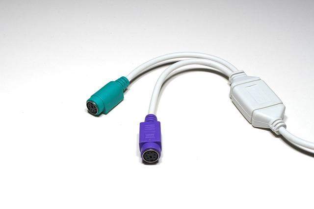
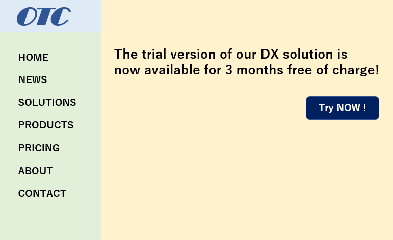

# AIチャットを体験しよう

## (STEP1-0) ChatGPTにログイン

- [ChatGPT](https://openai.com/blog/chatgpt)を右クリックして「新しいウィンドウで開く」
- 「Try ChatGPT」をクリック
- 「Log in」をクリック
- Googleアカウントでログイン

※ Googleアカウント登録をしていない方→ [Googleアカウント作成](../Preparation/GoogleAccount.md)

※ ChatGPTに登録をしていない方→ [サービス登録](../Preparation/ServiceSignUp.md)

## (STEP1-1) ChatGPTで案内文を作成する

- 下記の文をコピーしてChatGPTに入力し、案内文を作成してみよう

```
沖縄という都会から離れた場所で、最新技術に触れられるという点を売りにした
OOL TECH CONNECTというイベントを9/22に開催するのでその案内文を作って。
イベント内容は、技術セミナー20分を３件と２時間の最新ツール体験ハンズオンです。
```

**ChatGPTの基本的な使い方**

- 回答の入力
  - `Send a message`と表示されている部分にプロンプトを入力する
  - 改行したい場合はShift+Enterを入力する
  - 入力が終わったらEnterを入力するか、紙飛行機のアイコンのクリックで入力内容を送信する
- 回答の出力
  - `Stop generating`という表示が右下にある間は回答の出力中
  - 右下が`Regenerate`という表示になったら回答の出力は終了している
  - `Regenerate`をクリックすると回答を再生成する。再生成後の回答には`<2/2`のような番号がつき`<`の部分をクリックすることで以前の回答内容を閲覧できる
  - `Continue generating`という表示が右下に出力された場合は、一度に回答できる文字数に達したが回答内容がまだ残っていることを示しているのでクリックして回答の出力を続行させる
- 会話のリセット
  - やりとりした内容をリセットして新しい会話を始めたい場合は、左上の`+New chat`をクリック
- 以前の会話内容
  - 会話を始めると左側のメニューに吹き出しアイコンとプロンプト内容からつけられたタイトルが表示される
  - ペンアイコンでタイトル名を変更できる
  - ゴミ箱アイコンで会話内容を削除できる
  - 新しいチャットで別の会話を始めた場合もこのメニューをクリックすることで以前の会話の続きからチャットすることができる

## (STEP1-2) ChatGPTに簡単なWebプログラミングを作成させてみる

### Javascriptコードの実行環境Replitを立ち上げよう

- [Replit](https://replit.com/)にアクセス
- 右上の「Log in」をクリック
  - Replitに登録をしていない方→ [サービス登録](../Preparation/ServiceSignUp.md)
- 「+Create Repl」をクリック
- 「Create Repl」のウィンドウが開く
- Templateの「Seach Template」欄に`html`と入力して「HTML,CSS,JS」を選択
- Titleにプロジェクト名を入力。日本語でもOK
- 右下にある「+Create Repl」をクリック
- `index.html`、`script.js`、`style.css`が生成される

### ChatGPTにプログラムを作成させよう

下記のプロンプトを入力しましょう

```
テキストエリアに入力した文字列を赤い文字列として表示するJavascriptを作成してください。
作成内容はindex.html、style.css、script.jsで出力してください
```

### ChatGPTに出力されたコードをReplitへコピーしよう

- ChatGPT画面のHTML(index.html)のコード右上のCopy codeを選択してコードをコピー
- Replit画面のの左メニューのindex.htmlをクリックして、コード部分を表示させる
  - 表示されたコードをCtrl+aですべて選択し、Ctrl+vでChatGPTのコードに上書きする
- ChatGPT画面のCSS(style.css)のコード右上のCopy codeを選択してコードをコピー
- Replit画面の左メニューのstyle.cssをクリックして、コード部分を表示させる
  - 表示されたコードをCtrl+aですべて選択し、Ctrl+vでChatGPTのコードに上書きする
- ChatGPT画面のJavaScript(script.js)のコード右上のCopy codeを選択してコードをコピー
- Replit画面の左メニューのscript.jsをクリックして、コード部分を表示させる
  - Ctrl+vでChatGPTのコードを貼り付ける

### Replitでコードを実行させてみよう

- Replit画面の上部の「Run」をクリックしてコードを実行させる
- Replit画面の右側にテキストエリアが生成されるので文字を入力して赤い文字列が表示されることを確認しよう

### 実行結果がうまく動作しないときには

うまく動作しないことをChatGPTに伝えて修正してもらおう！

```
テキストエリアが表示されていません。バグを修正してください
```

```
文字が赤ではなく黒で表示されます。修正お願いします
```

### プログラムの修正を依頼してみよう

ボタンを押すと赤い文字列が表示されるプログラムになっている場合は、下記の修正依頼をしてみよう！

```
ボタンで赤い文字列を表示するのではなくリアルタイムに赤い文字列を表示するように修正して
```

文字列を入力するとすぐに赤い文字列が表示されるプログラムになっている場合は、下記の修正依頼をしてみよう！

```
すぐに赤い文字列を表示するのではなくボタンを押すと赤い文字列を表示するように修正して
```

## (STEP1-3) ChatGPTにアンケートを分類させてみる

### 自治体アンケートデータの入手

- 下記URLを右クリックして「新しいウィンドウで開く」
- e-Govデータポータル : オープンデータの取組に関する自治体アンケート結果_自由記述設問（令和２年）
  - <https://data.e-gov.go.jp/data/dataset/digi_20220315_0066/resource/86bead98-ea03-4970-94fb-b0047509770c>
- 「ダウンロード」ボタンをクリック
- `r2_survey_comments.xlsx`がダウンロードされる
- このExcelファイルのシート「No.21」のアンケートをコピーしてChatGPTに分類してもらいます

※ Excelを開けない方は下記からアンケート内容をコピーしてください

```
No	地方公共団体コード	地方公共団体名	内容
1	050008	秋田県	特になし
2	140007	神奈川県	特になし
3	013625	北海道 上ノ国町	未だ検討に至っていないことから、現段階では不明。
4	013676	北海道 奥尻町	特になし
5	014273	北海道 由仁町	特になし
6	034614	岩手県 大槌町	ごみ収集カレンダー
7	042021	宮城県 石巻市	震災関連情報（災害発生、対応、復旧、復興、支援等のナレッジ）
8	052060	秋田県 男鹿市	特になし
9	112283	埼玉県 志木市	特になし
10	131211	東京都 足立区	現時点ではなし。
11	131024	東京都 中央区	なし
12	132187	東京都 福生市	特になし
13	132021	東京都 立川市	未定
14	142069	神奈川県 小田原市	環境調査結果
15	152188	新潟県 五泉市	鳥獣出没箇所一覧、学校一覧、こども１１０番の家一覧、交番・駐在所一覧、ごみ品目別収集区分一覧
16	162116	富山県 射水市	"・宿泊施設一覧
・ＮＰＯ法人一覧
・選挙投票所一覧"
17	172057	石川県 珠洲市	"・ゴミ情報
・公共施設、観光地などの写真
"
18	223069	静岡県 西伊豆町	特になし
19	231002	愛知県 名古屋市	特になし。
20	232386	愛知県 長久手市	授乳室の場所
21	242021	三重県 四日市市	"・街の風景写真
現在の推奨データセットは機械判読ができるもの前提に設計されており、画像軽視の人が認識するための推奨データセットがないため。
画像形式で高品質な街の風景写真を公開できれば、地元の事業者がパンフレット作成の際や、町内会のイベント等での直接的な活用が見込まれ、また、取り組む際のハードルも低いのではないかと考えられる。"
22	242161	三重県 伊賀市	広報写真
23	272272	大阪府 東大阪市	標準データセット等を参考として、保有するデータのオープンデータ化を拡大・推進していきたと考えているが、取り組むにあたって所管課との調整が必要であることから具体的なデータセットについては未定である。
24	284815	兵庫県 上郡町	特になし
25	293431	奈良県 三郷町	・学校行事カレンダー
26	332020	岡山県 倉敷市	"動物目撃情報
※倉敷市では、鳥獣目撃情報（イノシシ、シカ、サル）及びホタル目撃情報の2種類の動物目撃情報を公開済み。また、その全国共通データレイアウトをVLEDに提供し、次期推奨データセットでの検討を依頼している。"
27	342076	広島県 福山市	新型コロナウイルス関連情報（発生状況，PCR検査数，感染者数など）
28	352063	山口県 防府市	推奨データセットのうち基本編にまずは取り組むことで庁内の合意は諮られているが、それ以上の取り組みについては、検討できていないため。
29	402168	福岡県 小郡市	"・地域コミュニティ組織一覧
・市町長交際費
・市のあゆみ
・学童保育所一覧"
30	402192	福岡県 大野城市	なし
31	402311	福岡県 那珂川市	今のところありません。
32	444618	大分県 九重町	なし
```

### ChatGPTにアンケートの分類をさせてみよう

- 下記のプロンプトをコピーしてChatGPTに貼り付けた後にアンケート内容をコピペして実行させてください

```
以下のアンケートの内容を分類するカテゴリを作成してください。
###

```

- 次に下記のプロンプトを入力してカテゴリ分類表を作成してもらいましょう

```
カテゴリ分類を左の列にして、そのカテゴリに分類されたアンケートNoとアンケート数を表にしてください
```

### 分類結果がいまいちなときには

修正内容をプロンプトで伝えて、所望の分類表を出力させましょう

```
もう少し細かくカテゴリ分類して表にしてください
```

```
カテゴリ分類をもう少しまとめた形にして表にしてください
```

```
未検討と記載なしは「要望なし」というカテゴリにまとめてください
```

## (STEP2-0) Bing Chatにログイン

- Microsoft Edgeを起動
- 検索エリアに`bing`と入力
- 検索結果の「Bing ( https://www.bing.com )」をクリック
- 右上のログインをクリック
- サインイン画面になるのでMicrosoftアカウントでログイン
- 上部の「チャット」をクリック
- Microsoft Edge以外のブラウザの場合、「Microsoft Edgeで開く」ボタンをクリック
- 会話のスタイルを選択して利用開始

※ Microsoftアカウント登録をしていない方→ [Microsoftアカウント作成](../Preparation/MSAccount.md)

## (STEP2-1) Bing Chatに画像を入力して内容を質問する

### 質問するための画像をダウンロード

[](cable.jpg)

- 上のケーブル画像を右クリックして「名前を付けて画像を保存」を選択してダウンロードしておく

### Bing Chatに画像をアップロード

- 下記のいずれかの方法でBing Chatへケーブル画像をアップロードする
  - プロンプト入力欄へ画像をドラッグ＆ドロップ
  - プロンプト入力欄のカメラアイコンをクリックして「このデバイスからアップロード」を選択し、ケーブル画像をアップロード

### 画像について質問する

さらに下記のプロンプトを入力しよう

```
この画像に写っているのは何？
```

**Bing Chatの基本的な使い方**

- 回答の入力
  - `何でも聞いてください`と表示されている部分にプロンプトを入力する
  - 改行したい場合はShift+Enterを入力する
  - 入力が終わったらEnterを入力するか、紙飛行機のアイコンのクリックで入力内容を送信する
- 回答の出力
  - `■応答を停止して`という表示が右下にある間は回答の出力中
  - `■応答を停止して`が表示されなくなり、追加の質問候補が表示される状態になったら、回答の出力は終了している
- 会話のリセット
  - やりとりした内容をリセットして新しい会話を始めたい場合は、プロンプト欄の左にあるほうきアイコン`新しいトピック`をクリック
- 以前の会話内容
  - 会話を始めると左側のメニューに吹き出しアイコンとプロンプト内容からつけられたタイトルが表示される
  - ペンアイコンでタイトル名を変更できる
  - ゴミ箱アイコンで会話内容を削除できる
  - 新しいトピックで別の会話を始めた場合もこのメニューをクリックすることで以前の会話の続きからチャットすることができる


## (STEP3-1) OpenAI APIで作成したプログラムを動かしてみよう

### 質問したい内容が記述されたPDFファイルをダウンロード

下記のURLを右クリックして「名前を付けてリンク先を保存」を選択して`gaiyo.pdf`をダウンロード

- 経済産業省 : 2023年版 ものづくり白書 概要
  - <https://www.meti.go.jp/report/whitepaper/mono/2023/pdf/gaiyo.pdf>

### Google Colabでプログラムを実行

- OTC参加者用 Googledrive
  - <https://drive.google.com/drive/folders/1Bbro9LBXtr4-S1VFBl9p2nhn9FoW700l>
- 上記URLを右クリックして「新しいウィンドウで開く」を選択
- 「OpenAIAPI_MultifFiles.ipynb」をダブルクリックして開く
- 左上のメニューの「ファイル」＞「ドライブにコピーを保存」をクリック
- 新しいタブが開くので、そちらのタブへ移動
- 左にあるフォルダアイコンをクリックして、開いたペインにある上向き矢印のアイコンをクリックしてgaiyo.pdfをアップロードする
  - 開いたペインに直接gaiyo.pdfをドラッグ&ドロップしてもアップロード可能
- 「ライブラリのインストール」の下にある`[ ]`にカーソルを合わせて再生ボタンになったらクリック
  - アイコンの円がクルクル周りだするのでしばらく待つ
  - 再び再生ボタン表示になったら次へ
- 「PDFファイルの読み込み」の下にある`[ ]`にカーソルを合わせて再生ボタンになったらクリック
  - アイコンの円がクルクル周りだするのでしばらく待つ
  - 再び再生ボタン表示になったら次へ
- 「プロンプト入力用WebUI起動」の下にある`[ ]`にカーソルを合わせて再生ボタンになったらクリック
  - アイコンの円がクルクル周りだするのでしばらく待つ
  - 再び再生ボタン表示になったら下へスクロール
- 一番下にチャットのUIが表示されるようになるので、「質問内容を入力後、Enterキーで送信」の欄に下記のプロンプトをコピペしてEnterキーを押す

```
GXとは何ですか
```

他にもgaiyo.pdfに書かれた内容について質問すれば対応した内容を回答してくれる

## (STEP4) いろいろ試してみよう

以下の項目から興味があるものを試してみましょう

### (4-1) ChatGPTに相談してみよう

相談のサンプルプロンプト

```
冷蔵庫の中にじゃがいも、卵、豆腐が残っています。いい晩御飯のメニューはありますか？
```

```
夏バテ気味でスタミナがつく昼食を食べたいです。外食で1000円くらいの予算だとするとおすすめは何になりますか？
```

### (4-2) ChatGPTで物語を作成してみよう

物語作成のサンプルプロンプト

```
浦島太郎の物語をなろう小説風にアレンジして
```

```
カレーの作り方を時代小説風に教えて
```

### (4-3) ChatGPTで比較・分析をしてみよう

最新情報が不要な事項について比較・分析をしてみましょう

比較・分析のサンプルプロンプト

```
きのこの山とたけのこの里の比較を表形式で作成して
```

### (4-4) ChatGPTで翻訳・要約してみよう

- [CNN news](https://edition.cnn.com/)にアクセスして英文記事を開く
- 下記のプロンプトの`###`の下に英文記事の内容をコピペしてEnter


```
以下の文を日本語で400文字以内に要約して
###

```

※ 改行は「Shift+Enter」で入力します。


### (4-5) ChatGPTで○×ゲームをプログラミングしよう

#### Javascriptコードの実行環境Replitを立ち上げよう

- [Replit](https://replit.com/)にアクセス
- 「+Create Repl」をクリック
- 「Create Repl」のウィンドウが開く
- Templateの「Seach Template」欄に`html`と入力して「HTML,CSS,JS」を選択
- Titleにプロジェクト名を入力。日本語でもOK
- 右下にある「+Create Repl」をクリック
- `index.html`、`script.js`、`style.css`が生成される

#### ChatGPTにプログラムを作成させよう

下記のプロンプトを入力しましょう

```
○×ゲームのjavascriptを作成してください。
作成内容はindex.html、style.css、script.jsで出力してください
```

#### ChatGPTに出力されたコードをReplitへコピーしよう

- ChatGPT画面のHTML(index.html)のコード右上のCopy codeを選択してコードをコピー
- Replit画面の左メニューのindex.htmlをクリックして、コード部分を表示させる
  - 表示されたコードをCtrl+aですべて選択し、Ctrl+vでChatGPTのコードに上書きする
- ChatGPT画面のCSS(style.css)のコード右上のCopy codeを選択してコードをコピー
- Replit画面の左メニューのstyle.cssをクリックして、コード部分を表示させる
  - 表示されたコードをCtrl+aですべて選択し、Ctrl+vでChatGPTのコードに上書きする
- ChatGPT画面のJavaScript(script.js)のコード右上のCopy codeを選択してコードをコピー
- Replit画面の左メニューのscript.jsをクリックして、コード部分を表示させる
  - Ctrl+vでChatGPTのコードを貼り付ける

#### Replitでコードを実行させてみよう

- 上部の「Run」をクリックするとコードが実行される

#### プログラムの修正を依頼してみよう

このゲームはいろいろ不具合がでてくるので修正してほしい内容をプロンプトに入力する

- 動作しない → `Runを押しても動作しません。修正してください`
- ○が置けない → `○を置くことができません。修正してください`
- マスが3x3で表示されていない → `縦3、横3になっていません。修正してください`
- ○が3つ並んでも勝利判定されない → `○が3つ並んでも勝利になりません。修正してください`
- 相手の手番をコンピューターに打たせたい → `相手の手番をコンピューターが打つように修正して`

### (4-6) Bing ChatでURLを指定して翻訳・要約をしてもらう

**英語のwikipedia記事を日本語にして要約**

サンプルプロンプト

```
https://en.wikipedia.org/wiki/Transformer_(machine_learning_model)
の内容を日本語で要約して
```

**CNN記事を日本語にして要約**

- [CNN news](https://edition.cnn.com/)にアクセスして英文記事を開く
- 英文記事のURLをコピー
- `このサイトを日本語で要約して。`とプロンプトで入力後、コピーした内容をペースト

### (4-7) Bing Chatに観光案内してもらう

サンプルプロンプト

```
沖縄の国際通りでお土産を買うのにおすすめの店を5つほど教えて
```

```
沖縄で那覇市から日帰り観光できるスポットを5つ挙げて、所要時間・料金などを比較した表形式にしてください
```

### (4-8) Bing ChatにWebページ用コードを作成してもらおう

#### Webページ画像をダウンロード

[](webpage.png)

- 上のWebページ画像を右クリックして「名前を付けて画像を保存」を選択してダウンロードしておく

#### Bing Chatに画像をアップロード

- Bing Chatで「新しいトピック」をクリックし、新しい会話を開始
- 会話のスタイルを「より創造的に」に変更 (他の会話スタイルだとコードを生成してくれない場合が多いため)
- 下記のいずれかの方法でBing ChatへWebページ画像をアップロードする
  - プロンプト入力欄へ画像をドラッグ＆ドロップ
  - プロンプト入力欄のカメラアイコンをクリックして「このデバイスからアップロード」を選択し、Webページ画像をアップロード

#### 画像のレイアウトのWebページ作成を依頼する

さらに下記のプロンプトを入力しよう

```
この画像のレイアウトになるようにindex.htmlを作成してください
```

※ 現時点では日本語の内容や画面の背景色は正しく認識してくれないようです。

#### Replitの立ち上げ

- [Replit](https://replit.com/)にアクセス
- 「+Create Repl」をクリック
- 「Create Repl」のウィンドウが開く
- Templateの「Seach Template」欄に`html`と入力して「HTML,CSS,JS」を選択
- Titleにプロジェクト名を入力。日本語でもOK
- 右下にある「+Create Repl」をクリック
- `index.html`、`script.js`、`style.css`が生成される

#### Bing Chatが出力したコードをReplitへコピーしよう

- Bing Chat画面のHTML(index.html)のコード右上のCopy codeを選択してコードをコピー
- Replit画面の左メニューのindex.htmlをクリックして、コード部分を表示させる
  - 表示されたコードをCtrl+aですべて選択し、Ctrl+vでChatGPTのコードに上書きする
- Bing Chat画面のCSS(style.css)のコード右上のCopy codeを選択してコードをコピー
- Replit画面の左メニューのstyle.cssをクリックして、コード部分を表示させる
  - 表示されたコードをCtrl+aですべて選択し、Ctrl+vでChatGPTのコードに上書きする

#### ReplitでWebページを表示させよう

- Replit画面上部の「Run」をクリックすると右エリアにWebページが表示される

#### Webデザインの修正を依頼してみよう

- リンクが縦でなく横に並んでいたりしたら、`リンクは縦に並べてください`のように修正を指示して、修正されたコードをReplitに貼って表示させてみよう

