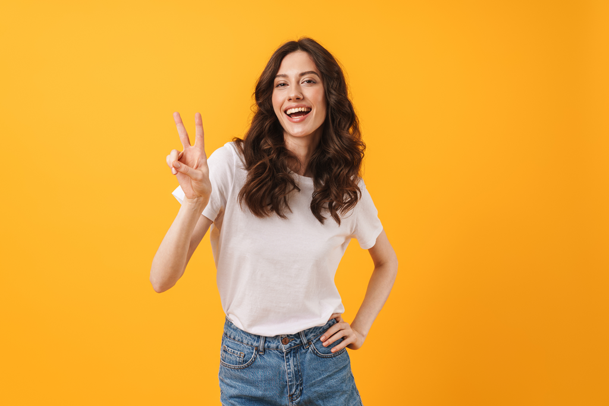
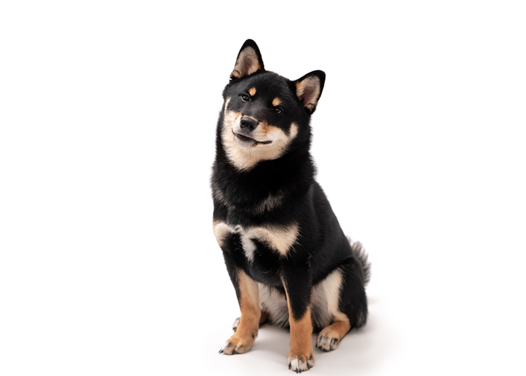
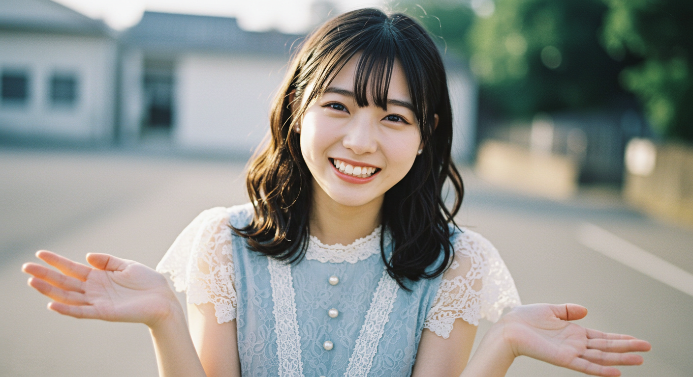

# 画像生成AIを体験しよう

## (STEP1) 画像の構図を制御しながら画像を生成してみよう

**◆ハンズオン内容◆** : 画像の対象やポーズを指定して画像を生成しよう

### (STEP1-1) PixAI.Artにログイン

- [PixAI.Art](https://pixai.art/)を右クリックして「新しいウィンドウで開く」
- 右上の「ログイン」ボタンをクリック (ユーザ名が表示されている場合はSTEP1-2へ進む)
- 「Continue with Google account」をクリックして、Googleアカウントでログイン
  - デイリー報酬のウィンドウが開いたら「10,000デイリークレジットをゲット」をクリック。「閉じる」になったらクリックしてウィンドウを閉じる

※ PixAI.Artに登録をしていない方→ [サービス登録](0_ServiceSignUp.md)

### (STEP1-2) PixAI.Artで画像を生成してみよう

- **「画像生成」画面**
  - 左メニューの「生成」アイコンをクリックして「画像生成」画面へ
- **画像生成パラメータの設定** : 右ペイン(右側の領域のこと)にある設定項目の内容を設定していく
  - 「**モデル**」の下部にある「もっと表示する」をクリックして、モデルウィンドウを開き、「**Moonbeam**」をクリックして選択後、右下の「このモデルを使用する」をクリック
    - これで「生成」に必要なクレジットが3,400→1,800に減少
  - 「**縦横比**」は「**1:1(512x512)**」に変更
    - これで「生成」に必要なクレジットが1,800→1,200に減少
  - 「画像枚数」は「一括(X4)」のまま
  - 「**高級設定**」を開いて「**Sampling Method**」を「DPM++ 2M Karras」から「**Euler a**」へ変更
    - これで「生成」に必要なクレジットが1,200→200に減少
- **プロンプトの入力**
  - 中央ペイン(中央の領域のこと)にある「プロンプト自動変換」の下の「プロンプトを入力してください」と書かれた部分がプロンプトの入力エリア
  - 「プロンプト自動変換」をチェックして「プロンプトを入力してください」が「直接韓国語、日本語や中国語などの自然言語を入力して画像生成できます！」に変化することを確認
  - プロンプトの入力エリアに下記のどちらかのプロンプト例をコピーして貼り付ける

```
白いブラウスを着た金髪をポニーテールにして緑色の瞳で微笑んでいる女性
```

```
スーツを着た赤髪で眼鏡をかけた赤い瞳の微笑んでいる男性
```

- **画像の生成**
  - プロンプト入力エリアの右下にある「生成」ボタンをクリックして画像を生成
- **生成した画像のダウンロード**
  - 生成された画像のうちの一つをクリックして拡大表示されたら、右上のダウンロードアイコン「↓」をクリックしてダウンロードしておく (後で使用します)
  - ダウンロードが完了したら、画像以外の背景部分をクリックするか右上の×アイコンをクリックして画像の拡大表示ウィンドウを閉じます

### (STEP1-3) ポーズと顔の特徴を反映した画像を生成してみよう

- **ポーズ画像のダウンロード**
  - 下記の画像をダウンロードしておく (右クリックして名前を付けて画像を保存をクリック)

[](../MediaFiles/peace_sign.png)　peace_sign.png

- **画像生成設定**
  - 右ペインの「ControlNet」の下の「ポーズコントロールを追加」をクリック
  - 「Method(コントロール方法)」の「DWポーズ」をクリック
  - 「画像をアップロード」をクリックしてポーズ画像(pease_sign.png)をアップロード
  - 棒人間が表示されたら「確認」をクリック
  - 「キャラ参照」下の「キャラ画像をアップロード」をクリック
  - (STEP1-2)でダウンロードした画像をアップロード
  - プロンプト欄の右下にある「オプション＋」をクリックして「顔修正」の右の「＋追加」をクリック
    - これで生成のクレジットが700→1,750になる
  - 「プロンプト自動変換」はチェックしたまま、プロンプトの入力エリアに下記テキストを入力後、「生成」をクリックして画像を生成

```
ピースサインをしている人
```

### (STEP1-4) 犬の特徴を反映した画像を生成してみよう

- **犬画像のダウンロード**
  - 下記の画像をダウンロードしておく (右クリックして名前を付けて画像を保存をクリック)

[](../MediaFiles/shiba.png)　shiba.png

- **画像生成設定**
  - 左上の「P」をクリックしてトップページに戻った後に、再度左メニューの「生成」をクリック
  - 「**モデル**」の下の「もっと表示する」をクリックし、モデルウィンドウで「**Moonbeam**」を選択して「このモデルを使用する」をクリック
  - 「**縦横比**」を「**1:1(512x512)**」に変更
  - 「**高級設定**」を開いて「**Sampling Method**」を「DPM++ 2M Karras」から「**Euler a**」へ変更
  - 「プロンプト自動変換」をチェックした状態にしておく
  - 「キャラ参照」下の「キャラ画像をアップロード」をクリック
  - ダウンロードした犬画像(shiba.png)をアップロード
  - プロンプトの入力エリアに下記テキストを入力後、「生成」をクリックして画像を生成

```
雪道を駆ける柴犬
```

## (STEP2) 高画質な画像を生成してみよう

**◆ハンズオン内容◆** : Le Chatを使用して高画質な画像を生成しよう

### (STEP2-1) Le Chatにログイン

- [Le Chat](https://chat.mistral.ai)を右クリックして「新しいウィンドウで開く」
- MISTRAL AI画面で「Sign in with Google」を選択してGoogleアカウントでログイン
- 「Terms of Service」で提示される「I accept the Terms of Use and Le Chat Terms of Services」をチェックして「Continue」をクリック
  - ※ 「I would like to receive updates and news about Le Chat」はチェック不要

### (STEP2-2) Le Chatで画像を作成

- 「Ask le Chat or @mention an agent」と書かれたプロンプト欄の右下の「Image generation」をクリックして文字がオレンジ色に変更されることを確認
- 下記のプロンプト例をコピーしてプロンプト入力欄に貼り付け後、「→」ボタンをクリック

```
フランスのオープンカフェで金髪女性が紅茶を飲んでいる
```

```
データセンターでサーバーを交換する技術者、漫画風
```

```
FAKEと書かれたPC画面を見て驚く女性
```

```
患者を診察する歯医者
```

```
アイディアをひらめいたビジネスマン
```

```
雪山の上空からドローンが航空写真を撮影している
```

```
砂浜でPCを持ってくつろぐビジネスマン
```

```
草原で茶髪の女の子が目玉焼きの乗ったトーストをおいしそうにほおばる
```

```
かわいいダックスフントが絨毯の上からこちらを見上げている
```

```
近未来的なフォルムのバイクが高速道路を疾走している
```

```
AIロボットが少女にコーヒーを入れている
```

## (STEP3) 生成AIを使って画像のレタッチをしてみよう

**◆ハンズオン内容◆** : 画像の外側の補完や不要なモノの消去などを体験しよう

### (STEP3-1) 画像の外側を補完してみよう

- **画像のダウンロード**
  - 下記の画像をダウンロードしておく (右クリックして名前を付けて画像を保存をクリック)

[](../MediaFiles/woman1.jpg)　woman1.jpg

- **My Editにログイン**
  - [My Edit](https://myedit.online/jp/photo-editor)を右クリックして「新しいウィンドウで開く」
  - 右上の「サインイン」をクリック
  - 「CyberLinkアカウントでサインイン」画面で「Google」アイコンを選択してGoogleアカウントでログイン
  - 「CyberLinkへようこそ」画面で情報受け取りが不要ならチェックマークを外して「次へ」をクリック
- **無料クレジットの受け取り**
  - 右上のユーザーアイコンをクリックして「無料クレジットを獲得」を選択し、「3クレジットをもらう」をクリック。受け取り後は右上の×をクリックして無料クレジット受け取りウィンドウを閉じる
- **AI画像拡張で画像の外側を補完**
  - 上部メニューの「画像編集ツール」にマウスカーソルをもっていくとメニューが開くので、「AI画像拡張」をクリック
  - 「ファイルを選択」をクリック
  - 「より良いエクスペリエンスのためのデータ処理」ウィンドウが開いたら、データ処理内容に同意するチェックボックスにチェックを入れて「続行」をクリック
  - `woman1.jpg`をアップロード
  - 「縦横比」を「1:1」に変更して画像を少し上へ移動させる
  - 「生成」ボタンをクリック

### (STEP3-2) 画像の不要なモノを削除してみよう

- **画像のダウンロード**
  - 下記の画像をダウンロードしておく (右クリックして名前を付けて画像を保存をクリック)

[](../MediaFiles/woman2.jpg)　woman2.jpg

- **Clipdropにログイン**
  - [Clipdrop](https://clipdrop.co/)を右クリックして「新しいウィンドウで開く」
  - 右上の「Sign-in/Sign-up」をクリック
  - 「Sign in to continue」画面で「Continue with Google」を選択してGoogleアカウントでログイン
- **不要なモノを削除**
  - 上から3段目の一番左にある「Cleanup」をクリック
  - 「Click, paste, or drop a file here to start.」をクリックして`woman2.jpg`をアップロード
  - 緑色の円でテーブルの上の物を塗りつぶして「Clean」をクリック

### (STEP3-3) 画像の背景を除去してみよう

- **Clipdropのメインページへ戻る**
  - 左上の「< Back」をクリックして「CLEANUP」の画面に戻る
  - 左上の「Clipdrop by Jasper」をクリックしてメインページへ戻る
- **背景の除去**
  - 上から2段目の一番右にある「Remove background」をクリック
  - 「Click, paste, or drop up to 10 files here to start.」をクリックして`woman2.jpg`をアップロード
  - 「Remove background」をクリック

