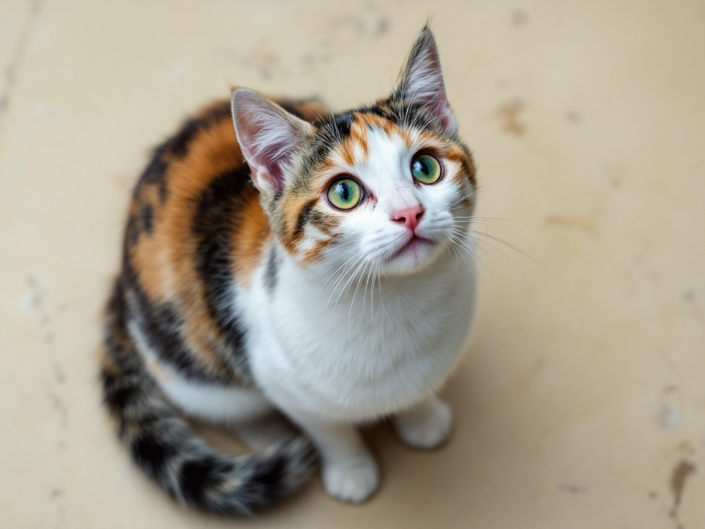

# その他AIを体験しよう

## (STEP1) 動画生成AIを体験しよう

**◆ハンズオン内容◆** : 動画生成AIのHailuo AIを体験をしよう

### (STEP1-1) 動画生成AI Hailuo AIで動画を生成しよう

- [Hailuo AI](https://hailuoai.video/)を右クリックして「新しいウィンドウで開く」
- 右上の「Sign In」をクリック
- HailuoAI Video画面で「Continue with Google」をクリックしてGoogleアカウントでログイン
- 左メニューの「Create」をクリック
- 次のいずれかの方法で動画を生成してみよう
  - (1) 「Text to Video」タブでテキストのみから動画を生成
    - (1-1) 「Unleash Your Creativity! Share Your Story Here」を書かれたプロンプト欄に下記のプロンプト例をコピペして「30」と書かれたアイコンをクリック
  - (2) 「Image to Video」タブで画像とテキストで動画を生成
    - (2-1) 「Drag/Paste/Click to upload new photo」をクリックして動画をアップロード
    - (2-2) 「Unleash Your Creativity! Share Your Story Here」を書かれたプロンプト欄に下記のプロンプト例をコピペ
    - (2-3) 「Model」の「I2V-01」を「I2V-01-live」に変更して「30」と書かれたアイコンをクリック

**プロンプト例 (Text to Video用)**

```
フランスのオープンカフェで金髪女性が紅茶を飲んでいる
```

```
雪山の上空からドローンが航空写真を撮影している
```

```
夜の未来的な都市景観を上空から撮影、飛行する車が高層ビルの間を行き交い、ネオンライトが輝く。
```

```
子どものおもちゃが積み上げられた部屋の中をかわいらしいくまのぬいぐるみがよちよちと歩いている。
```

```
アメリカ西部開拓時代の酒場で銃をかまえるカウボーイとならず者が対峙している。カメラは彼らのまわりをまわるように映している
```

```
人々と色とりどりの農産物で賑わう農産物市場の空撮。カメラは上空に舞い上がり、コミュニティの雰囲気を捉えている。
```

```
スタイリッシュな女性が、暖かく光るネオンとアニメーションの街の看板で満ちた東京の通りを歩いています。彼女は黒のレザージャケット、長い水色のドレス、黒いブーツを着用し、黒いハンドバッグを持っています。サングラスを身につけています。彼女は自信を持って、そしてカジュアルに歩きます。通りは湿っており、反射して、カラフルな光のミラー効果を生み出しています。多くの歩行者が歩いています。
```

**入力画像＋プロンプト例 (Image to Video用)**

[](../MediaFiles/businessman.jpg)　businessman.jpg

```
静かにPCのキーボードを操作しているビジネスマン。背後では波がしずかに打ち寄せている。カモメたちは沖の方へゆっくりと滑空している。
```

[](../MediaFiles/beach.jpg)　beach.jpg

```
砂浜に波が打ち寄せている。遠くの雲はゆっくり動いている。
```

[](../MediaFiles/robot.jpg)　robot.jpg

```
会議室のロボットに話しかけている男性。ロボットはうなづきながら話を聞いている。ほかの人物はしずかに座っている。
```

[](../MediaFiles/cat.jpg)　cat.jpg

```
猫が床で楽しそうに遊んでいる
```

[](../MediaFiles/dog.jpg)　dog.jpg

```
犬が遊んでいる
```

[](../MediaFiles/robot2.jpg)　robot2.jpg

```
ロボットがこちらにあいさつしている
```

- 動画生成が完了したら動画クリックで拡大再生ができる
  - 拡大時は左上の「＜」アイコンで前画面へ戻れる
- 左上の「三」アイコンにマウスを重ねると左メニューが現れる。
- 左メニューの「Mine」をクリックすると今まで作成した動画を一覧表示で見ることができる

## (STEP2) 解説動画生成AIを体験しよう

**◆ハンズオン内容◆** : 解説動画生成AIのNoLangを体験をしよう

### (STEP2-1) 解説動画生成AI NoLangで解説動画を作成しよう

- [NoLang](https://no-lang.com/)を右クリックして「リンクを新しいウィンドウで開く」
- 右上が「日本語版」になっているのを確認して「ログイン」をクリック
  - 「English Ver.」になっている場合は「日本語版」に変更してから「ログイン」をクリックしてください
- 「NoLang」画面で「Googleでログイン」をクリックしてGoogleアカウントでログイン
- ログイン後に利用規約画面が表示された場合、メールでの通知が不要なら「重要ニュースをメールで受け取る」のチェックを外した後に「同意してログイン」をクリック
- 上部の「指示に応じた解説動画を作成します」と書かれたプロンプト欄に下記のプロンプト例から選んだ内容をコピペして紙飛行機アイコンをクリック

```
沖縄の魅力とは？
```

```
沖縄で人気のお土産は？
```

```
生成AIのひみつ
```

```
ゆいレールの歴史
```

```
シーサーのひみつ
```

- 今まで作成した解説動画は左メニューの「マイページ」をクリック後、中央ペインの上部メニューに出てくる「作成した動画」クリックで一覧表示を見ることができます
- 左メニューの「動画編集」クリックで生成した動画を選んで編集が可能な動画編集モード画面を開くことができる

## (STEP3) 3Dオブジェクト生成AIを体験しよう

**◆ハンズオン内容◆** : 3Dオブジェクト生成AIで3Dオブジェクトを生成して動作させてみよう

### (STEP3-1) Meshyで3Dオブジェクトを生成して動作させてみよう

- [Meshy](https://www.meshy.ai/)を右クリックして「新しいウィンドウで開く」
- 「Start for Free」あるいは右上の「ログイン」をクリック
- 「Welcome to Meshy」ウィンドウが開くので「Continue with Google」をクリックしGoogleアカウントでログイン
- 「Meshyへようこそ！」画面で職業を選択して「次へ→」
- さらに業界・会社の規模・Meshyを知った経緯を選択後「送信」
  - 新規ユーザ限定特典のウィンドウが開いたら「後で」をクリック
- 上部メニューの「ワークスペース」をクリック後、「テキスト生成モデル」を選択。あるいは、「テキストからモデルを生成」をクリック
- 左の「新モデル」と書かれたペインが「テキスト生成モデル」になっていることを確認後、その下の「プロンプト」欄に下記テキストを入力して、「生成する」をクリック

```
トレーニングウェアを来たジブリ映画風のかわいい女性の全身像。左右対称でAポーズをとり、直立した状態で腕を斜め下に開き、手のひらを内側に向けた姿勢をしている。
```

- **※1分ほどでオブジェクトが生成される**
- 生成された3Dオブジェクトをクリックすると中央ペインに表示される。右上の虫眼鏡アイコンで各オブジェクトの拡大表示・縮小表示ができる
- 気に入ったオブジェクトを選んでクリックし、「テクスチャ」と「リメッシュ」をオンにして「確認する」をクリック
- **※3分ほどでテクスチャが生成される**
- テクスチャ生成されたオブジェクトをクリックすると中央ペインに表示される
- 下部にある「リギング」をクリック
- 「ヒューマノイド」をクリックして「次へ」をクリック
- キャラクターを中央前向きにして高さを調節して「次へ」をクリック
- 顎・肩・肘・手首・股間・膝・足首にマーカーを配置して「確認する」をクリック
  - 対象ではない場合は対称性のチェックを外して左右別に配置する
- リギングが完了すると中央ペインでオブジェクトが歩くモーションをするようになる
- 右ペインの「アニメート」配下にある「ライブラリ」でオブジェクトのモーションを追加できる
  - 「アニメート」配下の「私のアニメーション」でオブジェクトに設定されたモーションを選択することができる

**その他の3Dオブジェクトを生成する場合のプロンプト例**

```
ジブリ映画風のかわいい柴犬の全身像。左右対称で足を真っすぐにして立っている姿勢をしている。
```

```
かっこいい赤色のスポーツカー
```

## (STEP4) AIアバターを生成しよう

**◆ハンズオン内容◆** : AIアバター生成AIで画像をしゃべらせてみよう

### (STEP4-1) アバター用人物画像の入手

  - 下記の画像をダウンロードしておく (右クリックして名前を付けて画像を保存をクリック)

[](../MediaFiles/woman3.jpg)　woman3.jpg

### (STEP4-2) アバター用音声ファイルの作成

- [TTSMAKER](https://ttsmaker.com/)を右クリックして「リンクを新しいウィンドウで開く」
- 右上の「Language」を「日本 - Japanese」に変更
- その下の「Voices」が「406 - Yuki つみゆき」になっていることを確認
- 「Maximum characters 500 remaining 500 available」の下のテキストエリアに下記テキストをコピーして貼り付け

```
みなさん、沖縄オープンラボへようこそ！
```

- 「Captcha Code」に右に表示されている4桁の数字を入力
- 「Convert To Speech」をクリックして音声ファイルを作成
  - 「Convert To Speech」をクリック後、「Verify you're human for the first time」ウィンドウが表示された場合は「Click to verify」をクリックして「OK」ボタンをクリック
- 「Download Voice Files」をクリックして音声ファイルをダウンロード
  - `ttsmaker-file-YYYY-MM-DD-HH-MM-SS.mp3`という形式のファイル名となる

### (STEP4-3) Vidnoz AIにログイン

- [Vidnoz AI](https://jp.vidnoz.com/)を右クリックして「リンクを新しいウィンドウで開く」
- 右上の「ログイン」をクリック
- 「Vidnozへようこそ」画面で「Google」をクリックしてGoogleアカウントでログイン
- 「どんな種類の動画を作成したいですか？」に回答
- 「テンプレートを選択して、AI動画の作成を簡単に開始します。」の画面で「スキップ」を選択
  - 何か広告がでたら「いいえ、結構です」をクリック

### (STEP4-4) AIアバター作成

- 左メニューの「アバター」をクリック
- 上部右にある「喋れる顔写真」にマススを重ねて「写真をアップロード」をクリック
- 「クリアかつポジティブな顔の写真をこちらにドラッグしてアップロードしてください。」をクリックして`woman3.jpg`をアップロード
- 「性別」を「女性」、「背景を削除」のチェックをオン(右側へ移動)にして「次へ」をクリック
- 「スクリプトを入力した後、…」の説明の下の「スキップ」をクリック
- 「アップロード」をクリックして「音声をアップロード」を選択し、
作成した`ttsmaker-file-YYYY-MM-DD-HH-MM-SS.mp3`という形式の音声ファイルをアップロードする
- 音声のアップロードが終わったら右上の「生成する」をクリック

## (STEP5) アンケート回答しよう

- 下記URLにアンケートのURLが記載されたテキストがあるのでアンケートへご回答お願いします。

- OTC参加者用 Googledrive
  - <https://drive.google.com/drive/folders/1Bbro9LBXtr4-S1VFBl9p2nhn9FoW700l>

