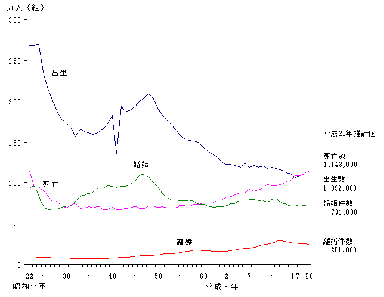

# AIチャットを体験しよう

## AIチャット

- [ChatGPT](https://openai.com/blog/chatgpt)
- [Bing Chat](https://www.bing.com/)
- [Google Bard](https://bard.google.com/)

## ChatGPTの利用開始までの流れ

- [ChatGPT](https://openai.com/blog/chatgpt)にアクセス
- 「Try ChatGPT」をクリック
- 「Sign UP」をクリック
- Googleアカウントでログイン

## ChatGPTでチャットしてみよう

「Send a message」の欄に質問を入力します

※ 送信が「Enter」、改行が「Shift+Enter」です。

### 物語を作成する

- `浦島太郎の物語をなろう小説風にアレンジして`
- `カレーの作り方を時代小説風に教えて`

### 最新情報が不要な事項の比較・分析を依頼する

- `きのこの山とたけのこの里の比較を表形式で作成して`

### 翻訳・要約を依頼する

```
以下の文を日本語で400文字以内に要約して
###

```

- `###`の下に英文をコピペします
- ※ 改行は「Shift+Enter」で入力します。
- コピペする英文は下記の「CNN news」の英文記事からコピペしましょう
  - https://edition.cnn.com/

### 数式を表示させてみる

- `波動方程式の式をLatex形式で教えて`


## ChatGPTにプログラムを作らせよう

### Javascriptコードの実行環境Replitにアクセスしよう

- Javascriptコード検証用サイト : [Replit](https://replit.com/)

**Replitの使い方**

- サイト\(<https://replit.com/>\)にアクセス
- 右上の「Sign up」をクリック
- 「Continue with Google」を選択して、Googleアカウントでログイン
- アンケート画面になる (「Skip」してOK)
- ホーム画面になる
- チュートリアルが表示される (右上の×をクリックしてスキップしてもOK)
- 「+Create Repl」をクリック
- 「Create Repl」のウィンドウが開く
- Templateの「Seach Template」欄に`html`と入力して「HTML,CSS,JS」を選択
- Titleにプロジェクト名を入力。日本語でもOK
- 右下にある「+Create Repl」をクリック
- `index.html`、`script.js`、`style.css`が生成されるので編集
- 上部の「Run」をクリックすればコードを実行できる
- プロジェクトの削除はプロジェクト名をクリックして、右上の「…」が縦になっている箇所をクリックして「Delete」を選択後、「Yes, delete this Repl」をクリック

### 簡単なWebプログラミングを依頼

プロンプト

`テキストエリアに入力した文字列を赤い文字列として表示するJavascriptをReplit形式で教えて`

javascriptだけを提示してきたら次のプロンプトを入力します

`html,css,jsの三つのファイルを作成して`

- index.htmlのコード右上のCopy codeを選択してコードをコピー
- Replitの左メニューのindex.htmlをクリックして、コード部分を表示させる
  - 表示されたコードをCtrl+aですべて選択し、Ctrl+vでChatGPTのコードに上書きする
- styles.cssのコード右上のCopy codeを選択してコードをコピー
- Replitの左メニューのstyles.cssをクリックして、コード部分を表示させる
  - 表示されたコードをCtrl+aですべて選択し、Ctrl+vでChatGPTのコードに上書きする
- script.jsのコード右上のCopy codeを選択してコードをコピー
- Replitの左メニューのscript.jsをクリックして、コード部分を表示させる
  - 表示されたコードをCtrl+aですべて選択し、Ctrl+vでChatGPTのコードに上書きする

コードの実行

- 上部の「Run」をクリックするとコードが実行される
- 右側にテキストエリアが生成されるので文字を入力して赤い文字列が表示されることを確認しよう


### ○×ゲームのプログラミングを依頼

プロンプト

`○×ゲームのjavascriptをreplit形式で教えて`

html,css,jsの三つのファイルが出力されていない場合は以下のプロンプトを入力

`html,css,jsの三つのファイルを作成して`

- index.htmlのコード右上のCopy codeを選択してコードをコピー
- Replitの左メニューのindex.htmlをクリックして、コード部分を表示させる
  - 表示されたコードをCtrl+aですべて選択し、Ctrl+vでChatGPTのコードに上書きする
- styles.cssのコード右上のCopy codeを選択してコードをコピー
- Replitの左メニューのstyles.cssをクリックして、コード部分を表示させる
  - 表示されたコードをCtrl+aですべて選択し、Ctrl+vでChatGPTのコードに上書きする
- script.jsのコード右上のCopy codeを選択してコードをコピー
- Replitの左メニューのscript.jsをクリックして、コード部分を表示させる
  - 表示されたコードをCtrl+aですべて選択し、Ctrl+vでChatGPTのコードに上書きする

コードの実行

- 上部の「Run」をクリックするとコードが実行される


このゲームはいろいろ不具合がでてくるので修正してほしい内容をプロンプトに入力する

- 動作しない → `Runを押しても動作しません。修正してください`
- ○が置けない → `○を置くことができません。修正してください`
- マスが3x3で表示されていない → `縦3、横3になっていません。修正してください`
- ○が3つ並んでも勝利判定されない → `○が3つ並んでも勝利になりません。修正してください`
- 相手の手番をコンピューターに打たせたい → `相手の手番をコンピューターが打つように修正して`

## Bing Chatの利用開始方法

- [Bing Chat](https://www.bing.com/)にアクセス
- 上部の「チャット」をクリック
- Microsoft Edge以外のブラウザの場合、「Microsoft Edgeで開く」ボタンをクリック
- 会話のスタイルを選択して利用開始

## Bing Chatでチャットしてみよう

- 「なんでも聞いてください」の欄に質問を入力します

### URLを指定して、その内容の翻訳・要約を依頼する

```
https://proceedings.neurips.cc/paper_files/paper/2017/file/3f5ee243547dee91fbd053c1c4a845aa-Paper.pdf
の論文の内容を日本語で要約して箇条書きで教えてください
```

- Attention is All You Need
  - https://proceedings.neurips.cc/paper_files/paper/2017/file/3f5ee243547dee91fbd053c1c4a845aa-Paper.pdf


### 最新情報を問い合わせる

- `大谷翔平の今シーズンの成績を教えて`

参照元リンクが提示されるので、提示先にアクセスして間違っているかを確認。

間違っていたら、

`本塁打はXX本なので間違っています`

と訂正してみましょう


### 最新情報への更新が重要な内容を問い合わせる

- `東京駅から津駅までの行き方を教えて`


### 画像付きで教えてくれる内容を入力する

- `カピバラのことを教えて`

## Google Bardの利用開始方法

- [Google Bard](https://bard.google.com/)にアクセス
- Googleにログインしていない場合、「ログイン」をクリックしてGoogleアカウントでログイン
- 「Bardを試す」ボタンをクリック
- 「Bard はこのアカウントでは利用できません」と表示される場合は、新しいGoogleアカウントを作成して、そのアカウントでログインしてください。 → [Googleアカウント作成](../Preparation/GoogleAccount.md)
- 「利用規約とプライバシー」が表示されるので内容を確認し「同意する」をクリック
- 「Bard は試験運用中のサービスです」と表示されるので「続行」をクリック

## Google Bardの英語版で画像についてチャットしてみよう

### Googleの言語設定を英語に変更

- [Google](https://www.google.com)へアクセス (右クリックして新しいウィンドウで開いてください)
- 右上のユーザアイコンをクリック
- アカウント名の下の「Googleアカウントを管理」をクリック
- 左メニューの「個人情報」をクリック
- 下の方にスクロールして「その他の情報とGoogleサービスの設定」にある「ウェブ向けの全般設定」＞「言語」をクリック
- 「優先言語」の日本語(日本)の右に表示されているペンアイコンをクリック
- 「言語の追加」で「English」＞「United States」を選択して「保存」をクリック

### Google Bardの英語版へアクセス

- [Google Bard](https://bard.google.com/)にアクセス

### 画像を入力して内容を質問する(1)

[](dog.png)

- 上記の画像をダウンロードしておく (右クリックして名前を付けて画像を保存をクリック)
- Bardの下部のプロンプト入力欄の左にある「＋」アイコンをクリック
- Upload fileをクリックして画像をアップロード
- プロンプトに`What is this image?`と入力
- `回答を日本語に訳して`と入力

### 画像を入力して内容を質問する(2)

下記の画像は[厚生労働省：平成２０年人口動態統計の年間推計](https://www.mhlw.go.jp/toukei/saikin/hw/jinkou/suikei08/index.html)
の「人口動態総覧の年次推移」のgif画像をpng画像に変換したもの

[](zu01.png)

- 上記の画像をダウンロードしておく (右クリックして名前を付けて画像を保存をクリック)
- Bardの下部のプロンプト入力欄の左にある「＋」アイコンをクリック
- Upload fileをクリックして画像をアップロード
- プロンプトに`Explain this image`と入力
- `回答を日本語に訳して`と入力

### Googleの言語設定を日本語に戻す

- [Google](https://www.google.com)へアクセス (右クリックして新しいウィンドウで開いてください)
- 右上のユーザアイコンをクリック
- アカウント名の下の「Manage your Google Account」をクリック
- 左メニューの「Personal info」をクリック
- 下の方にスクロールして「Other info and preferences for Google services」にある「General preferences for the web」＞「Language」をクリック
- 「Preferred Language」のEnglish(United States)の右に表示されているペンアイコンをクリック
- 「Add Language」で下のほうまでスクロールし「日本語」を選択して「Save」をクリック

