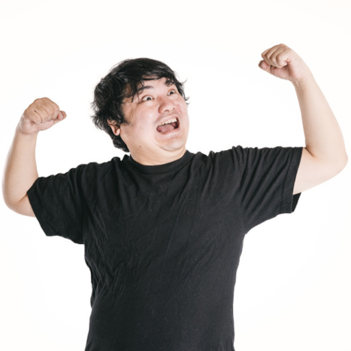

# 画像生成AIを体験しよう

## 画像生成AI

- [Bing Image Creator](https://www.bing.com/create)
- [Canva](https://www.canva.com/ja_jp/)
- [Leonardo.Ai](https://leonardo.ai/)
- [Seaart](https://www.seaart.ai/)
- [PixAI](https://pixai.art/)

## 生成AI.GO版 Stable Diffusionで画像を生成しよう

生成AI.GOへの登録を忘れた方はこちら→[画像生成AIを体験しよう(2)](ImageGenAI2.md)

### Stable Diffusionの起動

- 生成AI.GOに登録したGoogleアカウントでGmailを開く
- 「GenAI」でメールを検索してヒットしたメールを開く
- アクセスURLとして記載されたURLをクリック
- Login画面のusernameとpasswordにメールに記載されたユーザ名とパスワードを入力して「Login」をクリック
- 「Generative AI GO! Console View for SDWebUI」の画面になるので「Start App」をクリック
- Booting…という表示になるので30秒ほど待って「Refresh」をクリック
- 「Stable Diffusion Web UI(GradioURL)」というリンクが表示されるのでクリック
- Stable Diffusion Web UI画面が開く

### Stable Diffusionでの画像生成

- Stable Diffusionのcheckpointでモデルを選択
  - (アニメ系の画像を生成したい方) CounterfeitV30_v30...を選択
  - (実写系の画像を生成したい方) bra_v5...を選択
- バッチ回数(一度に生成する画像の枚数)を「4」に変更
- プロンプト欄にプロンプトを入力 (下記の行をトリプルクリックで選択後右クリックしてコピーしたものを貼り付けましょう)
  - `masterpiece, best quality, 1 girl, business suit`
- ネガティブプロンプト欄にネガティブプロンプトを入力 (下記の行をダブルクリックで選択後右クリックしてコピーしたものを貼り付けましょう)
  - `nsfw`
- 「生成」ボタンをクリックして画像を生成
- 生成された画像を選択して画像の下にある「保存」をクリック
- 右下に「Download」リンクが出現するのでクリックして画像をダウンロード

### ポーズを反映した画像の生成

　ポーズ反映元画像

- 上記の画像をダウンロードしておく (右クリックして名前を付けて画像を保存をクリック)
- ControlNet v1.1.173の右の▲をクリックして下部を展開
- ControlNet Unit0のタブを選択
- 「有効化」をチェックしてプリプロセッサを「openpose_full」、モデルを「control_v11p_sd15_openpose_fp16」に設定
- ここに画像をドロップのエリアにポーズ反映元画像をドロップ
- ControlNet Unit1のタブを選択
- 「有効化」をチェックしてプリプロセッサを「reference_only」に設定
- ここに画像をドロップのエリアにさっき作成してダウンロードした少女の画像をドロップ
- プロンプト欄にプロンプトを入力 (下記の行をトリプルクリックで選択後右クリックしてコピーしたものを貼り付けましょう)
  - `masterpiece, best quality, 1 girl, business suit`
- ネガティブプロンプト欄にネガティブプロンプトを入力 (下記の行をダブルクリックで選択後右クリックしてコピーしたものを貼り付けましょう)
  - `nsfw`
- 「生成」ボタンをクリックして画像を生成

### 顔部分の修正

- 「シード」の下の「-1」の右にあるサイコロとリサイクルマークアイコンのうち、「リサイクルマーク」をクリックして、「シード」の値を固定にします (-1以外の値になるのを確認してください)
  - ランダムに戻す場合は「サイコロ」アイコンをクリックするか「-1」を直接入力します
- ADtailer(After Detailer:アフターディテイラー)の右の▲をクリックして下部を展開
- 「Enable ADetailer」をチェック
- 「生成」ボタンをクリックして画像を生成

### 落書きからの画像生成

　落書き画像

- 上記の画像をダウンロードしておく (右クリックして名前を付けて画像を保存をクリック)
- ADtailerの「Enable ADetailer」のチェックを外しておく
- シードを-1に設定
- ControlNet Unit1のタブを選択
- 画像の右上の×をクリックして画像を削除し、有効化のチェックを外す
- ControlNet Unit0のタブを選択
- 画像の右上の×をクリックして画像を削除
- 有効化のチェックは入れたままにする
- プリプロセッサを「scribble_hed」、モデルを「control_v11p_sd15_scribble_fp16」に設定
- 「ここに画像をドロップ」のエリアに落書き画像をドロップ
- プロンプト欄にプロンプトを入力 (下記の行をトリプルクリックで選択後右クリックしてコピーしたものを貼り付けましょう)
  - `masterpiece, best quality, 1 girl, business suit, having an apple`
- ネガティブプロンプト欄にネガティブプロンプトを入力 (下記の行をダブルクリックで選択後右クリックしてコピーしたものを貼り付けましょう)
  - `nsfw`
- 「生成」ボタンをクリックして画像を生成

### Stable Diffusion終了処理

- 「Generative AI GO! Console View for SDWebUI」の画面で「Stop App」をクリックしてアプリを停止しておく

## Leonardo.Aiで画像を生成しよう

### Leonardo.Aiのユーザー登録

- [Leonardo.Ai](https://leonardo.ai/)を右クリックして「新しいウィンドウで開く」
- 「Launch App」をクリック
- 「Yes, I’m whitelisted」をクリック
- 「Login to Leonardo.Ai」をクリック
- 「Continue with Google」をクリック
- Goolgeアカウントでログインし、携帯に送られてくる本人確認のコードを入力
- Get startedでユーザ名、興味のある分野、NSFW表示設定を確認して「Next」
- 「Ensusiast」などをクリックして「Start using Leonardo」をクリック

### Leonardo.Aiで画像生成

- 「AI Image Generation」をクリックして画像生成画面へ
- 左メニューの「Alchemy」と「Prompt Magic」のチェックをオフに設定
- Number of Images(画像生成枚数)を「4」に設定
- AI Generation Toolと書かれた右ペインの二段目左端にある「Finetuned Model」と小さく書かれたアイコンをクリックしてモデルを選択
  - 「SDXL 0.9」を選択
- 「Type a prompt ...」(以後プロンプト入力エリアと呼ぶ)にプロンプトを入力
  - 「a cute dog」と入力
- 「Generate」をクリックして画像を生成
- 生成された画像をクリックするとダウンロードやアップスケールを選ぶことができる
- 生成された画像の列の右にある「…」をクリックして生成した画像を一括削除することができる

### Leonardo.Aiでプロンプト生成

- 右ペインのモデル表示の下にある「Image Generation」の右にある「Prompt Generation」をクリック
- 「Enter a basic prompt idea…」に日本語で描きたい画像の内容を記入
  - 「アイディアをひらめいて嬉しそうなビジネスマン」と入力
- 「Ideate」をクリック
- 生成されたプロンプトの一つを選んで「Generate」をクリックし、画像を生成

## プロンプト作成方法

### 翻訳サイトの利用

- 翻訳サイト[DeepL](https://www.deepl.com/ja/translator)を右クリックして「新しいウィンドウで開く」
- DeepLのサイトの「翻訳するにはテキストを入力してください。」に「生成したい画像内容を表す文字列」を入力
  - 例) 「幻想的な森の中の小屋」と入力
- 右に英訳された文(上述の例の場合は「fantastic cabin in the forest」)が表示されるのでコピー

### プロンプト解析サイトの利用

- Goolgeで生成したい画像の元ネタを入手
  - 例) 「皇帝ペンギン」で画像検索してダウンロード
- プロンプト解析サイト[methexis-inc/img2prompt](https://replicate.com/methexis-inc/img2prompt)を右クリックして「新しいウィンドウで開く」
- img2promptサイトの「image」の下のエリアをクリックし、ダウンロードした画像をアップロードして「Submit」をクリック
- 右のOutputの部分に画像に対応するプロンプトが表示されるのでコピー

### 生成画像ギャラリーの利用

- Leonardo.Aiの場合
  - 左メニューの上部の←|をクリック
  - 「Recent Creations」に表示されている画像から気に入ったものをクリック
  - 「Remix」をクリック
  - モデル・プロンプトがコピーされるので「Generate」をクリックして画像を生成
- SeaArtの場合
  - 左メニューの上部の←|をクリック
  - 「Explore」に表示されている画像から気に入ったものをクリック
  - 「Try」をクリック
  - モデル・プロンプトがコピーされるので紙飛行機アイコンをクリックして画像を生成
- PixAIの場合
  - 左メニューの上部の「P」をクリック
  - 「ホーム」に表示されている画像から気に入ったものをクリック
  - 「参考作品として使用」をクリック
  - 「この作品を参考画像をしますか？」のウィンドウが開くので「確認」をクリック
  - モデル・プロンプトがコピーされるので「生成しましょう！」をクリックして画像を生成
- Stable Diffusionの場合
  - [CIVIT AI](https://civitai.com/)を開く
  - 気に入った画像をクリックしてプロンプトをコピーする
  - モデルやサンプラー・パラメータ情報も必要に応じて反映させる

## 画像生成関連サイト

### 翻訳サイト

- [DeepL](https://www.deepl.com/ja/translator)

### モデル・LoRA公開サイト

- [CIVIT AI](https://civitai.com/)
- [Hugging Face](https://huggingface.co/)

### プロンプト解析サイト

- [Unprompt AI](https://unprompt.ai/)
- [methexis-inc/img2prompt](https://replicate.com/methexis-inc/img2prompt)

### フリー素材サイト

- [ぱくたそ](https://www.pakutaso.com/)

### ポーズ取得サイト

- [OpenPoses\(ポーズ集\)](https://openposes.com/)
- [3D Openpose Editor](https://zhuyu1997.github.io/open-pose-editor/)

### AIコンテンツ判定サイト

- [AI-Generated Content Detection](https://hivemoderation.com/ai-generated-content-detection)

