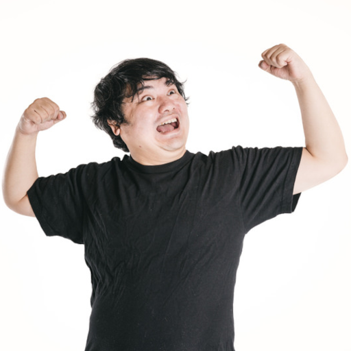
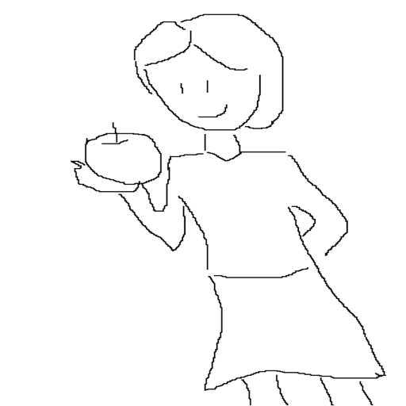

# 画像生成AIを体験しよう(2)

## PixAIで画像を生成しよう

### PixAIのユーザ登録

- [PixAI](https://pixai.art/)を右クリックして「新しいウィンドウで開く」
- 右上の「ユーザー登録」ボタンをクリック
- 「Continue with Google account」をクリックして、Googleアカウントでログイン
- デイリー報酬10,000の獲得ウィンドウが開くので「クレジットを獲得」をクリック

### PixAIでの画像生成

- 左メニューの「生成」をクリックして「作品を生成」を選択
- 右上の「ユーザー登録」ボタンをクリック
- モデルはデフォルトの「Whimsical」のまま
- 「ここにプロンプトを入力」のエリアに「1 girl」と入力
- 「生成しましょう！」をクリックして画像を生成
- 生成した画像をクリックして右上のダウンロードボタンをクリックしてダウンロード

### ポーズを反映した画像の生成

　ポーズ反映元画像

- 上記の画像をダウンロードしておく (右クリックして名前を付けて画像を保存をクリック)
- 右ペインのControlNetの下の「ポーズコントロールを追加」をクリック後、開いたウィンドウ上で「ポーズコントロールを追加」を選択
- 「Method」を「OpenPoseFull」に設定
- 「画像をアップロード」をクリックしてポーズ反映元画像をアップロード
- 「ポーズコントロールの追加」をクリックして、「Method」を「ご参考までに」にする
- 「画像をアップロード」をクリックして先ほど作成した1 grilの画像をアップロード
- 右下の「確認」をクリック後、「ここにプロンプトを入力」に「1 girl」と入力して「生成しましょう！」をクリックして画像を生成

### 落書きからの画像生成

　落書き画像

- 上記の画像をダウンロードしておく (右クリックして名前を付けて画像を保存をクリック)
- PixAIの右ペインのControlNetの下に設定された内容を右上の×アイコンを押して削除
- 「ポーズコントロールを追加」をクリック後、開いたウィンドウ上で「ポーズコントロールを追加」を選択
- 「Method」を「Scribble」に設定
- 「画像をアップロード」をクリックしてダウンロードした落書き画像をアップロード
- 右下の「確認」をクリック後、「ここにプロンプトを入力」に「1 girl, having an apple」と入力して「生成しましょう！」をクリックして画像を生成

## SeaArtで画像を生成しよう

### SeaArtのユーザ登録 (18歳以上のみ)

- [Seaart](https://www.seaart.ai/)を右クリックして「新しいウィンドウで開く」
- 右上の「ログイン」をクリック
- 「Googleで続行」をクリックして、Googleアカウントでログイン
- 「Welcome to the SeaArt」画面になるので、ニックネーム・興味分野を入力し、「私は18歳以上です」をチェック後、「使用を開始する」をクリック

[参考] 言語の変更方法

- 右上のユーザーアイコンへマウスを移動させて「設定(Settings)」をクリック
- 「創作設定(Generation Settings)」タブをクリックして言語を「日本語(English)」にして「セーブ(Save Settings)」

### SeaArtでの画像生成

- 「AIイラスト生成(AI Painting)」をクリックして画像生成画面へ
- 左メニューの「創作(Generate)」をクリック
- 右ペインの「モード(Mode)」を「デフォルト(Default)」に設定
- 右ペインの「モデル(Model)」で「もっと選ぶ(Choose more)」を選択してモデルを選択
  - (アニメ系)検索窓に「counter」と入力して「Counterfeit-V3.0」を選択
  - (実写系)検索窓に「bra」と入力して「BRA(Beautiful Realistic Asians) V5」を選択
- 中ペイン下部の「プロンプトを入力してください(Please enter prompt)」に「1 girl」と入力して紙飛行機アイコンをクリックして画像を生成
- 生成された画像をクリックすると拡大表示される。右クリックメニューから画像を保存できるので「girl.png」という名前で保存しておく
- 生成された画像の列の右にある「…」をクリックして生成した画像を一括削除することができる

### ポーズを反映した画像の生成

　ポーズ反映元画像

- 上記の画像をダウンロードしておく (右クリックして名前を付けて画像を保存をクリック)

- SeaArtの左メニューの「高級創作(Advanced)」＞「コントロールネット(ControlNet)」をクリック
  - メニューが出てきた場合は「openpose_full」を選択
  - メニューが出てこない場合は右ペインの「タイプ(Type)」をクリックして「openpose_full」を選択
- 「ファイルをここにドラッグするか、クリックしてアップロードする(Drop Image Here or Click to Upload)」部分にポーズ反映元画像をアップロード
- 中ペインの「ControlNet 1」の右にある「+」をクリック
- 右ペインの「コントロールネット(ControlNet)」の「タイプ(Type)」をクリックして「参考生成(Reference Generation)」を選択
- 先ほど作成した「girl.png」を中ペインにアップロード
- モデルを最初に選んでいたものに変更し、LoRAが選択されていたらゴミ箱アイコンを押して削除
- 中ペイン下部のプロンプト欄に「1 girl」と入力して紙飛行機アイコンで画像を生成

### 落書きからの画像生成

　落書き画像

- 上記の画像をダウンロードしておく (右クリックして名前を付けて画像を保存をクリック)

- SeaArtの左メニューの「高級創作(Advanced)」＞「コントロールネット(ControlNet)」をクリック
- 中ペインのControlNet 2の右上の×を押して削除
- 右ペインの「コントロールネット(ControlNet)」の「タイプ(Type)」をクリックして「scribble_hed」を選択
- ダウンロードしておいた落書き画像を中ペインにアップロード
- 中ペイン下部のプロンプト欄に「1 girl, having an apple」と入力して紙飛行機アイコンで画像を生成

