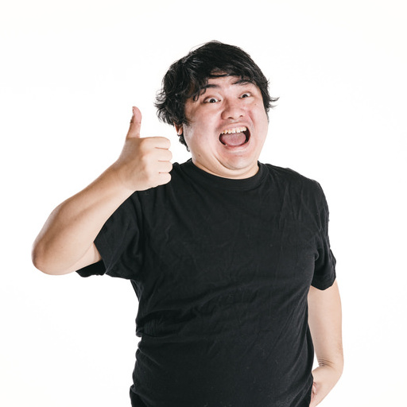

# 画像生成AIを体験しよう

## (STEP1-0) PixAI.Artにログイン

- [PixAI.Art](https://pixai.art/)を右クリックして「新しいウィンドウで開く」
- 右上の「ログイン」ボタンをクリック (ユーザ名が表示されている場合はSTEP1-1へ進む)
- 「Continue with Google account」をクリックして、Googleアカウントでログイン

※ PixAI.Artに登録をしていない方→ [サービス登録](../Preparation/ServiceSignUp.md)

## (STEP1-1) PixAI.Artで画像を生成してみよう

### 画像生成画面へ移動

- 左メニューの「生成」アイコンをクリックして「画像生成」画面へ
- デイリークエストのウィンドウが開いたら「デイリークレジット申請」の「申請」ボタンをクリック。「申請済み」になったらウィンドウ外をクリックすればデイリークエストウィンドウは消える

### 画像生成パラメータの設定

右ペイン(右側の領域のこと)にある設定項目の内容を設定していく

- 「モデル」はデフォルトの「Moonbeam」のまま
- 「Lora」は設定しない
- **「縦横比」は「プリセット」をクリックして「512x512」に変更する**
- 「画像枚数」は「一括(X4)」のまま
- 「HiRes」は設定しない
- 「顔修正」は設定しない
- 「ControlNet」は設定しない
- 「構図」は設定しない
- 「ネガティブ」と書かれている入力エリアは「ネガティブプロンプト」を記述する。ここも変更しない
- 「Sampling Steps」は変更しない(デフォルト:20)
- **「Sampling Method」は「DPM++ 2M Karras」から「Euler a」へ変更する**
- 「CFG Scale」は変更しない(デフォルト:6)
- 「シード」も空欄のままにしておく
- 「クリップスキップ」も変更しない(デフォルト:2)

ここまでの設定を実施すると、「生成しましょう！」の右の数字(生成に必要なクレジット数)が200になる

### プロンプトを入力

中央ペイン(中央の領域のこと)にある「プロンプト自動変換」の下の「プロンプトを入力してください」と書かれた部分がプロンプトの入力エリア

- 「高速生成」のチェックは入れたままにしておく
- 「プロンプト自動生成」をチェックして「プロンプトを入力してください」が「直接韓国語、日本語や中国語などの自然言語を入力して画像生成できます！」に変化することを確認します。
- プロンプトの入力エリアに下記テキストをコピーして貼り付ける

```
ビジネススーツの女性
```

### 画像を生成

- プロンプト入力エリアの右下にある紫色の「生成しましょう！」ボタンをクリックして画像を生成

### 生成した画像のダウンロード

- 生成された画像のうちの一つをクリックして拡大表示されたら、右上のダウンロードアイコン「↓」をクリックしてダウンロードしておく (後で使用します)
- ダウンロードが完了したら、画像以外の背景部分をクリックするか右上の×アイコンをクリックして画像の拡大表示ウィンドウを閉じます

## (STEP1-2) PixAI.Artでポーズと顔の特徴を反映した画像を生成してみよう

### ポーズ画像のダウンロード

[](pose.png)　ポーズ反映元画像(pose.png)

- 上記の画像をダウンロードしておく (右クリックして名前を付けて画像を保存をクリック)

### ポーズと顔の特徴を反映するためのControlNetの設定を実施して画像を生成

- 右ペインのControlNetの下の「ポーズコントロールを追加」をクリック
- 「Method(コントロール方法)」の「DWポーズ」をクリック
- 「画像をアップロード」をクリックしてポーズ反映元画像(pose.png)をアップロード
- 「画像のアップロード」と「画像の解析」が完了したら、「DWポーズ」と書かれたタブの右にある「＋」をクリック
- 「Method(コントロール方法)」の「Reference Only」をクリック
- 「注釈をアップロード」をクリックして(STEP1-1)で生成した画像(pixai-XX...X.png)をアップロード
- 「画像のアップロード」が完了したら、右下の「確認」をクリックしてControlNetの設定は完了
- 「プロンプト自動生成」はチェックしたまま、プロンプトの入力エリアに下記テキストを入力後、「生成しましょう！」をクリックして画像を生成

```
ビジネススーツの女性
```

## (STEP1-3) PixAI.Artで落書きから画像を生成してみよう

### 落書き画像のダウンロード

[](scribble_input.png)　落書き画像(scribble_input.png)

- 上記の画像をダウンロードしておく (右クリックして名前を付けて画像を保存をクリック)

### 落書きから画像を生成するControlNetの設定を実施して画像を生成

- 右ペインのControlNetの下に設定された内容を右上の×アイコンを押して二つとも削除
- 「ポーズコントロールを追加」をクリック
- 「Method(コントロール方法)」の「Scribble(ラフ絵)」をクリック
- 「画像をアップロード」をクリックしてダウンロードした落書き画像(scribble_input.png)をアップロード
- 右下の「確認」をクリックしてControlNetの設定は完了
- 「プロンプト自動生成」はチェックしたまま、プロンプトの入力エリアに下記テキストを入力後、「生成しましょう！」をクリックして画像を生成

```
リンゴを持った女性
```

## (STEP1-4) PixAI.Artで画像のキーワードを抽出して、そのキーワードで画像を生成してみよう

### キーワード抽出用画像のダウンロード

[](keyword.jpg)　キーワード抽出用画像(keyword.jpg)

- 上記の画像をダウンロードしておく (右クリックして名前を付けて画像を保存をクリック)

### キーワードの抽出とキーワードを元にした画像の生成

- 右ペインのControlNetの下に設定された内容を右上の×アイコンを押して削除
- 「プロンプト自動生成」のチェックを外す
- 「プロンプト自動生成」の右にある「画像のプロンプト抽出アイコン(画像→[T]に見えるアイコン)」をクリック後、開いたウィンドウをクリックしてキーワード抽出用画像(keyword.jpg)をアップロード
- キーワード摘出候補は四つ英文で示されるので一番上の文章を選択して「確認」をクリック
- プロンプト入力欄に選択した文章が入力された状態になるので「生成しましょう！」をクリックして画像を生成

## (STEP1-5) PixAI.Artでキーワードとポーズを元にした画像を生成してみよう

### ポーズも反映させるためにControlNetと併用してみる

- プロンプト欄は先ほど選択した文章が入力された状態にしておく
- 右ペインのControlNetの下の「ポーズコントロールを追加」をクリック
- 「Method(コントロール方法)」の「DWポーズ」をクリック
- 「画像をアップロード」をクリックしてキーワード抽出用画像(keyword.jpg)をアップロード
- 右下の「確認」をクリックしてControlNetの設定は完了
- 「生成しましょう！」をクリックして画像を生成

## (STEP1-6) PixAI.Artでポーズ編集してみる

- 「プロンプト自動生成」をチェックして、プロンプトの入力エリアに下記テキストを入力

```
体操服の女性
```

- 右ペインのControlNetの下に設定された内容を右上の×アイコンを押して削除
- 右ペインのControlNetの下の「ポーズコントロールを追加」をクリック
- 「Method(コントロール方法)」の「DWポーズ」をクリック
- 「ポーズ作成」をクリックして「ポーズエディター」を開く
- 「ポーズ編集」をクリック
- 「Live Preview」のチェックをオンに
- 丸部分をマウスでドラッグすることでポーズを変更できる
- ポーズ編集が終わったら、右下の「確認」をクリックしてControlNetの設定は完了
- 「生成しましょう！」をクリックして画像を生成

## (STEP2-0) Microsoft Designer Image Creatorにログイン

- [Image Creator](https://copilot.microsoft.com/images/create)を右クリックして「新しいウィンドウで開く」
- 「参加して作成」ボタンをクリック
- サインイン画面になるのでMicrosoftアカウントでログイン

## (STEP2-1) Image Creatorで画像を作成

下記のプロンプトをコピーしてプロンプト入力欄に貼り付け後、「作成」ボタンをクリック

```
サイバー空間に浮かぶ青く輝く幻想的なAIの顔、リアル
```

**注意事項**

- Imgge Creatorで作成した画像を指定して削除することはできません
- 20回画像を生成するとそれ以前の生成画像は「作品」の履歴から削除されます
- 生成した画像をクリックするとダウンロードすることができます

## (STEP2-2) Image Creatorで画像を作成 (2)

下記のプロンプトをコピーしてプロンプト入力欄に貼り付け後、「作成」ボタンをクリック

```
データセンターでサーバーを交換する技術者、フラットデザイン
```

## (STEP3-0) Google ImageFXにログイン

- [ImageFX](https://aitestkitchen.withgoogle.com/ja/tools/image-fx)を右クリックして「新しいウィンドウで開く」
- 右上の「Googleでログイン」をクリック
- 「AI Test Kitchen」画面で「ログイン」をクリック
- Googleアカウントでログイン
- メールの受信希望のチェックボックスがでてくるので「次へ」をクリック
- Googleのプライバシーポリシーの確認画面になるので下までスクロールさせた後に「次へ」をクリック
- 利用規約画面になるので「同意して続行」をクリック

## (STEP3-1) Google ImageFXで画像を作成

右下に「I'm Feeling Lucky」と書かれたテキストエリアがプロンプト入力エリアになる。ここに下記のテキストを貼り付けて「作成」ボタンをクリック

```
An engineer, replacing a server in a data center, comic style
```

## (STEP3-2) Google ImageFXで画像を作成 (2)

「comic style」が選択形式になっているので「realistic」(なければ他の選択肢)に変更して「作成」ボタンをクリック

## (STEP3-3) Google ImageFXで画像を作成 (3)

プロンプト入力エリアのテキストを下記のテキストに置き換えて「作成」ボタンをクリック

```
two Japanese businessmen, shake hands , in meeting room , comic style
```

## (STEP4) いろいろ試してみよう

### (4-1) Image Creatorで他の画像を作成してみる

- Image Creatorのウィンドウに移動
  - もうウィンドウを閉じている場合は、[Image Creator](https://copilot.microsoft.com/images/create)を右クリックして「新しいウィンドウで開く」

**プロンプト例**

```
FAKEと書かれたWebサイトをPCで閲覧して驚く女性
```

```
渋滞する交差点
```

```
患者を診察する歯医者
```

```
アイディアをひらめいたビジネスマン
```

### (4-2) PixAI.Artで他のポーズ画像で画像を生成してみる

**ポーズ(2)**

[](pose2.jpg)pose2.jpg

**ポーズ(3)**

[](pose3.jpg)pose3.jpg
