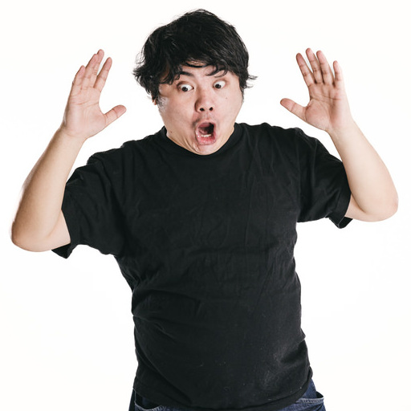

# 画像生成AIを体験しよう

## (STEP1-0) PixAI.Artにログイン

- [PixAI.Art](https://pixai.art/)を右クリックして「新しいウィンドウで開く」
- 右上の「ログイン」ボタンをクリック (ユーザ名が表示されている場合はSTEP1-1へ進む)
- 「Continue with Google account」をクリックして、Googleアカウントでログイン

※ PixAI.Artに登録をしていない方→ [サービス登録](../Preparation/ServiceSignUp.md)

## (STEP1-1) PixAI.Artで画像を生成してみよう

### 画像生成画面へ移動

- 左メニューの「生成」をクリックして「作品を生成」を選択して「画像生成」画面へ
  - 右上の「＋生成」アイコンクリックでも「画像生成」画面へ移動できる
- デイリークエストのウィンドウが開いたら「デイリークレジット申請」の「申請」ボタンをクリック。「申請済み」になったらウィンドウ外をクリックすればデイリークエストウィンドウは消える

### 画像生成パラメータの設定

右ペイン(右側の領域のこと)にある設定項目の内容を設定していく

- 「モデル」はデフォルトの「Moonbeam」のまま
- 「Lora」は設定しない
- **「縦横比」は「プリセット」をクリックして「512x512」に変更する**
- 「画像枚数」は「一括(X4)」のまま
- 「HiRes」は設定しない
- 「顔修正」は設定しない
- 「ControlNet」は設定しない
- 「構図」は設定しない
- 「ネガティブ」と書かれている入力エリアは「ネガティブプロンプト」を記述する。ここも変更しない
- 「Sampling Steps」は変更しない(デフォルト:20)
- **「Sampling Method」は「DPM++ 2M Karras」から「Euler a」へ変更する**
- 「CFG Scale」は変更しない(デフォルト:6)
- 「シード」も空欄のままにしておく
- 「クリップスキップ」も変更しない(デフォルト:2)

ここまでの設定を実施すると、「生成しましょう！」の右の数字(生成に必要なクレジット数)が200になる

### プロンプトを入力

中央ペイン(中央の領域のこと)にある「イラストのプロンプト」の「ここにプロンプトを入力」と書かれた部分がプロンプトの入力エリア

- 「高優先度」のチェックは入れたままにしておく
- プロンプトの入力エリアに下記テキストをコピーして貼り付ける

```
1 girl, business suit
```

### 画像を生成

- プロンプト入力エリアの右にある紫色の「生成しましょう！」ボタンをクリックして画像を生成

### 生成した画像のダウンロード

- 生成した画像をクリックして右上のダウンロードアイコン「↓」をクリックしてダウンロードしておく (後で使用します)
- ダウンロードが完了したら、画像以外の背景部分をクリックするか右上の×アイコンをクリックして画像の拡大表示ウィンドウを閉じます

## (STEP1-2) PixAI.ArtでControlNetを使ってみよう

### ポーズ画像のダウンロード

[](pose.png)　ポーズ反映元画像

- 上記の画像をダウンロードしておく (右クリックして名前を付けて画像を保存をクリック)

### ポーズと顔の特徴を反映した画像を生成する

- 右ペインのControlNetの下の「ポーズコントロールを追加」をクリック
- 「Method(コントロール方法)」の「DWポーズ」をクリック
- 「画像をアップロード」をクリックしてポーズ反映元画像をアップロード
- 「画像のアップロード」と「画像の解析」が完了したら、「DWポーズ」と書かれたタブの右にある「＋」をクリック
- 「Method(コントロール方法)」の「Reference Only」をクリック
- 「注釈をアップロード」をクリックして(STEP1-1)で生成した画像をアップロード
- 「画像のアップロード」が完了したら、右下の「確認」をクリックしてControlNetの設定は完了
- プロンプトの入力エリアに下記テキストを入力後、「生成しましょう！」をクリックして画像を生成

```
1 girl, business suit
```

## (STEP1-3) PixAI.ArtでControlNetを使ってみよう(2)

### 落書き画像のダウンロード

[](scribble_input.png)　落書き画像

- 上記の画像をダウンロードしておく (右クリックして名前を付けて画像を保存をクリック)

### 落書きから画像を生成する

- 右ペインのControlNetの下に設定された内容を右上の×アイコンを押して二つとも削除
- 「ポーズコントロールを追加」をクリック
- 「Method(コントロール方法)」の「Scribble(ラフ絵)」をクリック
- 「画像をアップロード」をクリックしてダウンロードした落書き画像をアップロード
- 右下の「確認」をクリックしてControlNetの設定は完了
- プロンプトの入力エリアに下記テキストを入力後、「生成しましょう！」をクリックして画像を生成

```
1 girl, having an apple
```

## (STEP1-4) PixAI.Artで画像のキーワードを抽出してみよう

### キーワード抽出用画像のダウンロード

[](keyword.jpg)　キーワード抽出用画像

- 上記の画像をダウンロードしておく (右クリックして名前を付けて画像を保存をクリック)

### キーワードの抽出

- 右ペインのControlNetの下に設定された内容を右上の×アイコンを押して削除
- 右ペインの「画像のキーワードを摘出」をクリック後、開いたウィンドウをクリックしてキーワード抽出用画像をアップロード
- キーワード摘出候補は四つ英文で示されるので一番上の文章を選択して「確認」をクリック
- プロンプト入力欄に選択した文章が入力された状態になるので「生成しましょう！」をクリックして画像を生成

## (STEP1-5) PixAI.Artで画像のキーワードを抽出してみよう(2)

### ControlNetと併用してみる

- プロンプト欄は先ほど選択した文章が入力された状態にしておく
- 右ペインのControlNetの下の「ポーズコントロールを追加」をクリック
- 「Method(コントロール方法)」の「DWポーズ」をクリック
- 「画像をアップロード」をクリックしてキーワード抽出用画像をアップロード
- 右下の「確認」をクリックしてControlNetの設定は完了
- 「生成しましょう！」をクリックして画像を生成


## (STEP2-0) Microsoft Designer Image Creatorにログイン

- [Image Creator](https://copilot.microsoft.com/images/create)を右クリックして「新しいウィンドウで開く」
- 「参加して作成」ボタンをクリック
- サインイン画面になるのでMicrosoftアカウントでログイン

## (STEP2-1) Image Creatorで画像を作成

下記のプロンプトをコピーしてプロンプト入力欄に貼り付け後、「作成」ボタンをクリック

```
サイバー空間に浮かぶ青く輝く幻想的なAIの顔、リアル
```

**注意事項**

- Imgge Creatorで作成した画像を指定して削除することはできません
- 20回画像を生成するとそれ以前の生成画像は「作品」の履歴から削除されます
- 生成した画像をクリックするとダウンロードすることができます

## (STEP2-2) Image Creatorで画像を作成 (2)

下記のプロンプトをコピーしてプロンプト入力欄に貼り付け後、「作成」ボタンをクリック

```
データセンターでサーバーを交換する技術者、フラットデザイン
```

## (STEP3-1) PixAI.Artでリアルタイムが画像生成を体験しよう

- PirxAI.Artのウィンドウに移動
  - もうウィンドウを閉じている場合は、[PixAI.Art](https://pixai.art/)を右クリックして「新しいウィンドウで開く」
- 左上の「画像」「リアルタイム」という選択肢の「リアルタイム」を選択
- 左に並んでいる「ゴミ箱」アイコンをクリックして「キャンバスをクリアしますか？」に対して「確認」をクリックして画面をクリア
- プロンプト欄に入力した内容に応じて画像がリアルタイムに変化するので、下記のプロンプトを順番に入力してみよう

```
a dog
```

```
a dog running a beach
```

```
a dog running a beach, white hair
```

```
a dog running a beach, white hair, with a girl
```

- また、左のキャンバスに絵を描くとその内容を右の生成画像に反映するので、いろいろ描いてみよう

## (STEP3-2) SDXL-Lightningの高速画像生成を体験しよう

- [SDXL-Lightning](https://huggingface.co/spaces/ByteDance/SDXL-Lightning)を右クリックして「新しいウィンドウで開く」
- 「Enter your prompt(English)」欄にプロンプトを入力すると画像が高速生成されるので下記のプロンプトを入力してみよう

```
a cute dog
```

```
a business woman operating a PC
```


## (STEP4) いろいろ試してみよう

### (4-1) Image Creatorで他の画像を作成してみる

- Image Creatorのウィンドウに移動
  - もうウィンドウを閉じている場合は、[Image Creator](https://copilot.microsoft.com/images/create)を右クリックして「新しいウィンドウで開く」

**プロンプト例**

```
FAKEと書かれたWebサイトをPCで閲覧して驚く女性
```

```
渋滞する交差点
```

```
患者を診察する歯医者
```

```
アイディアをひらめいたビジネスマン
```

### (4-2) PixAI.Artでポーズ編集してみる

- PirxAI.Artのウィンドウに移動
  - もうウィンドウを閉じている場合は、[PixAI.Art](https://pixai.art/)を右クリックして「新しいウィンドウで開く」
- 左上の「画像」「リアルタイム」という選択肢の「リアルタイム」を選択
- 右ペイン(右側の領域のこと)にある設定項目の内容を再設定する
  - **「縦横比」は「プリセット」をクリックして「512x512」に変更する**
  - **「Sampling Method」は「DPM++ 2M Karras」から「Euler a」へ変更する**
- 右ペインのControlNetの下の「ポーズコントロールを追加」をクリック
- 「Method(コントロール方法)」の「DWポーズ」をクリック
- 「ポーズ作成」をクリックして「ポーズエディター」を開く
- 「ポーズ編集」をクリックして右の棒人間のポーズを編集
  - 黒丸部分をマウスでドラッグすることでポーズを変更できる
- ポーズ編集が終わったら、右下の「確認」をクリックしてControlNetの設定は完了
- プロンプトの入力エリアに下記テキストを入力後、「生成しましょう！」をクリックして画像を生成

```
1 girl, gym suit
```

### (4-3) PixAI.Artでリアルタイムポーズ編集してみる

- 右ペインのControlNetの下に設定された内容を右上の×アイコンを押して削除
- 右ペインのControlNetの下の「ポーズコントロールを追加」をクリック
- 「Method(コントロール方法)」の「DWポーズ」をクリック
- 「ポーズ作成」をクリックして「ポーズエディター」を開く
- 「ポーズ編集」をクリック
- 「Live Preview」のチェックをオンに
  - 黒丸部分をマウスでドラッグしてポーズを変更すると背景の画像もそれに合わせて変化する
- ポーズ編集が終わったら、右下の「確認」をクリックしてControlNetの設定は完了
- プロンプトの入力エリアに下記テキストを入力後、「生成しましょう！」をクリックして画像を生成

```
1 girl, gym suit
```

### (4-4) PixAI.Artで他のポーズ画像で画像を生成してみる

**ポーズ(2)**

[](pose2.jpg)

**ポーズ(3)**

[](pose3.jpg)
