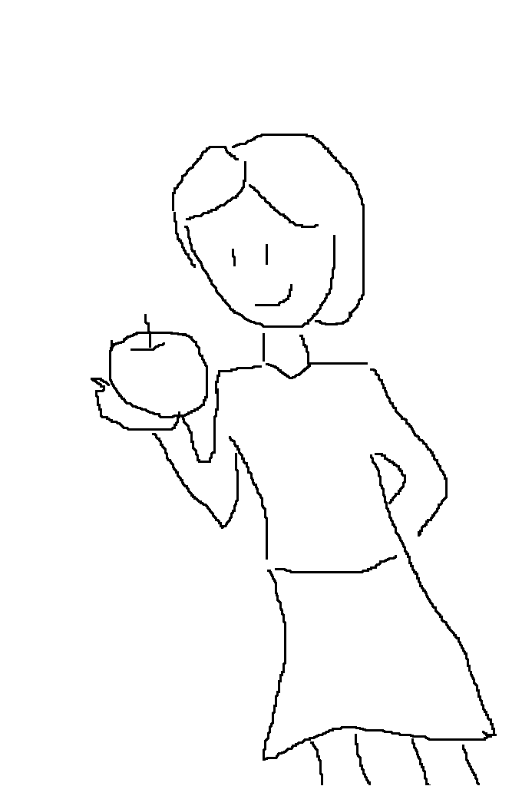

# 画像生成AIを体験しよう

## (STEP1-0) PixAIにログイン

- [PixAI](https://pixai.art/)を右クリックして「新しいウィンドウで開く」
- 右上の「ログイン」ボタンをクリック (ユーザ名が表示されている場合はSTEP1-1へ進む)
- 「Continue with Google account」をクリックして、Googleアカウントでログイン

※ PixAIに登録をしていない方→ [サービス登録](../Preparation/ServiceSignUp.md)

## (STEP1-1) PixAIで画像を生成してみよう

### 画像生成画面へ移動

- 左メニューの「生成」をクリックして「作品を生成」を選択して「画像生成」画面へ
  - 右上の「＋」アイコンクリックでも「画像生成」画面へ移動できる
- デイリー報酬10,000の獲得ウィンドウが開いた場合は「クレジットを獲得」をクリック

### 画像生成パラメータの設定

- 右ペインの「設定」エリアの設定を実施する
- 「モデル」はデフォルトの「Moonbeam」のまま
- 「Lora」は設定しない
- **「縦横比」は「512x512(正方形)」に変更する**
- 「画像枚数」は「一括(X4)」のまま
- 「HiRes」は設定しない
- 「ControlNet」は設定しない
- 「構図」は設定しない
- 「ネガティブ」と書かれている入力エリアは「ネガティブプロンプト」を記述する。ここも変更しない
- 「Sampling Steps」は変更しない(デフォルト:20)
- **「Sampling Method」は「DPM++ 2M Karras」から「Euler a」へ変更する**
- 「CFG Scale」は変更しない(デフォルト:6)
- 「Seed」も空欄のままにしておく

### プロンプトを入力

- 画像生成と書かれた中央ペインにある「イラストのプロンプト」の「ここにプロンプトを入力」を書かれた部分がプロンプトの入力エリアである
- プロンプトの入力エリアに下記テキストをコピーして貼り付ける

```
masterpiece, best quality, 1 girl, business suit
```

### 画像を生成

- プロンプト入力エリアの右にある紫色の「生成しましょう！」ボタンをクリックして画像を生成

### 生成した画像のダウンロード

- 生成した画像をクリックして右上のダウンロードアイコン「↓」をクリックしてダウンロードしておく (後で使用します)

## (STEP1-2) PixAIでControlNetを使ってみよう

### ポーズ画像のダウンロード

[](pose.png)　ポーズ反映元画像

- 上記の画像をダウンロードしておく (右クリックして名前を付けて画像を保存をクリック)

### ポーズと顔の特徴を反映した画像を生成する

- 右ペインのControlNetの下の「ポーズコントロールを追加」をクリック後、開いたウィンドウ上で「ポーズコントロールを追加」を選択
- 「Method」を「DW Pose」に設定
- 「画像をアップロード」をクリックしてポーズ反映元画像をアップロード
- 「ポーズコントロールの追加」をクリックして、「Method」を「ご参考までに」にする
- 「画像をアップロード」をクリックして(STEP1-1)で生成した画像をアップロード
- 右下の「確認」をクリックしてControlNetの設定は完了
- プロンプトの入力エリアに下記テキストを入力後、「生成しましょう！」をクリックして画像を生成

```
masterpiece, best quality, 1 girl, business suit
```

## (STEP1-3) PixAIでControlNetを使ってみよう(2)

### 落書き画像のダウンロード

[](scribble_input.png)　落書き画像

- 上記の画像をダウンロードしておく (右クリックして名前を付けて画像を保存をクリック)

### 落書きから画像を生成する

- PixAIの右ペインのControlNetの下に設定された内容を右上の×アイコンを押して削除
- 「ポーズコントロールを追加」をクリック後、開いたウィンドウ上で「ポーズコントロールを追加」を選択
- 「Method」を「Scribble」に設定
- 「画像をアップロード」をクリックしてダウンロードした落書き画像をアップロード
- 右下の「確認」をクリックしてControlNetの設定は完了
- プロンプトの入力エリアに下記テキストを入力後、「生成しましょう！」をクリックして画像を生成

```
masterpiece, best quality, 1 girl, having an apple
```

## (STEP2) いろいろ試してみよう

### (2-1) 日本語でプロンプト入力

日本語でプロンプトを入力しても画像を生成することができる

**例**

```
幻想的な森の風景
```

```
かわいい子犬
```

※ `空飛ぶお城`だと空に浮かぶお城の画像が生成されないが、`flying castle`にするときちんと空に浮かぶお城の画像が生成されるので、細かい点を反映させたい場合は英語で入力したほうがよい

### (2-2) 翻訳サイトを利用して英語プロンプトを作成する

- [DeepL](https://www.deepl.com/ja/translator)を右クリックして「新しいウィンドウで開く」
- 「翻訳するにはテキストを入力してください。」と書かれたエリアに画像にしたい内容を日本語で入力する
- 入力したエリアの右のエリアに英文が表示されるので、PixAIのプロンプト欄にコピーして画像を生成

**例**

```
握手するビジネスマン
```

```
渋滞する交差点
```

### (2-3) 生成画像ギャラリーを利用して画像を生成する

- 左メニューの上部の「P」をクリック
- 「ホーム」に表示されている画像から気に入ったものをクリック
- 「参考作品として使用」をクリック
- 「この作品を参考画像をしますか？」のウィンドウが開くので「確認」をクリック
- モデル・プロンプトがコピーされるので「生成しましょう！」をクリックして画像を生成

