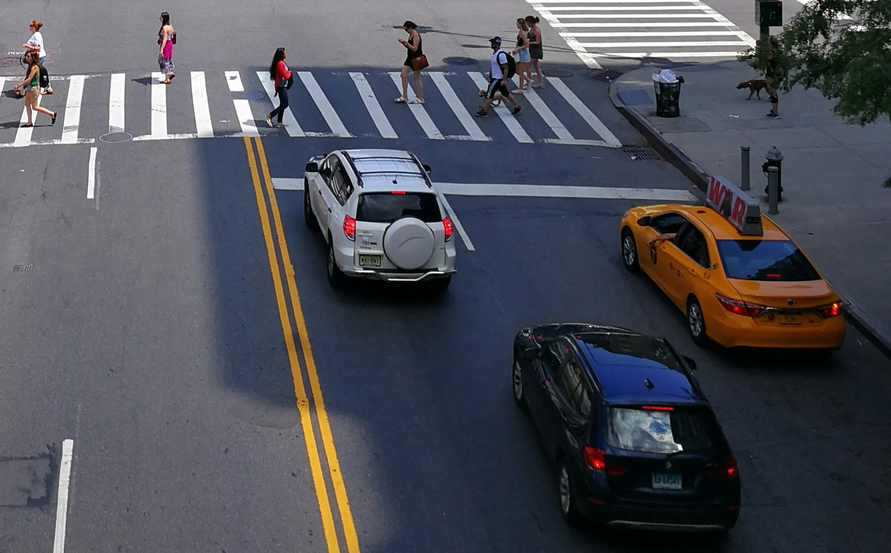
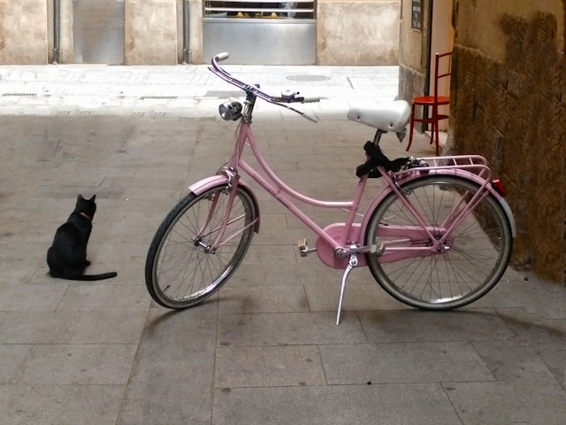

# その他AIを体験しよう

## (STEP1) 画像認識AIを体験しよう

- [YOLOv10](https://huggingface.co/spaces/kadirnar/Yolov10)
を右クリックして「新しいウィンドウで開く」
- 下記の二つ画像をダウンロード (右クリックして名前を付けて画像を保存をクリック)
- 「ここに画像をドロップまたはクリックしてアップロード」をクリックしてダウンロードした画像をアップロード
- 「Detect Objects」をクリックすると画像認識を実施
- 画像認識結果をダウンロードすると認識内容をきちんと読み取れる

[](image1.png)　image1.png

[](image2.png)　image2.png

## (STEP2) 動画生成AIを体験しよう

- [AnimateLCM](https://huggingface.co/spaces/wangfuyun/AnimateLCM)を右クリックして「新しいウィンドウで開く」
- 「Prompt」欄に下記プロンプトを入力して「Generate」ボタンをクリック
- 「Generated Animation」と表示されたら再生ボタンをクリック

```
a car driving on a snow road
```

## (STEP3) 3Dオブジェクト生成AIを体験しよう

- [Meshy](https://www.meshy.ai)を右クリックして「新しいウィンドウで開く」
- 「Try Meshy for Free」をクリック
- 「Welcome to Meshy」ウィンドウが開くので「Continue with Google」を選択しGoogleアカウントでログイン
- 左メニューの「Text to 3D」を選択
- 「Prompt」欄に下記プロンプトを入力して「Generate」ボタンをクリック
- 生成された3Dモデルをクリックすると右ペインに表示されるのでマウスを使って様々な角度からモデルを見ることができる

```
a cute dog
```

```
an ugly monster
```

```
a brave knight
```

```
a young waitress
```

## (STEP4) アンケート回答しよう

- 下記URLにアンケートのURLが記載されたテキストがあるのでアンケートへご回答お願いします。

- OTC参加者用 Googledrive
  - <https://drive.google.com/drive/folders/1Bbro9LBXtr4-S1VFBl9p2nhn9FoW700l>

